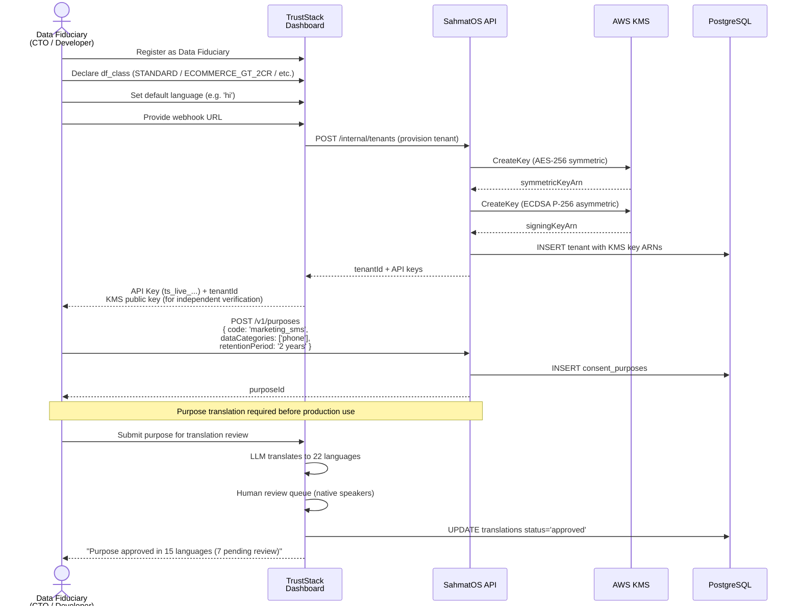
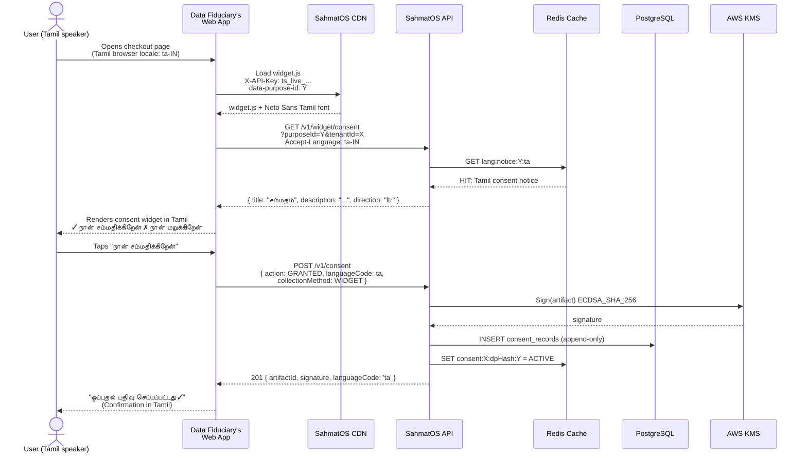
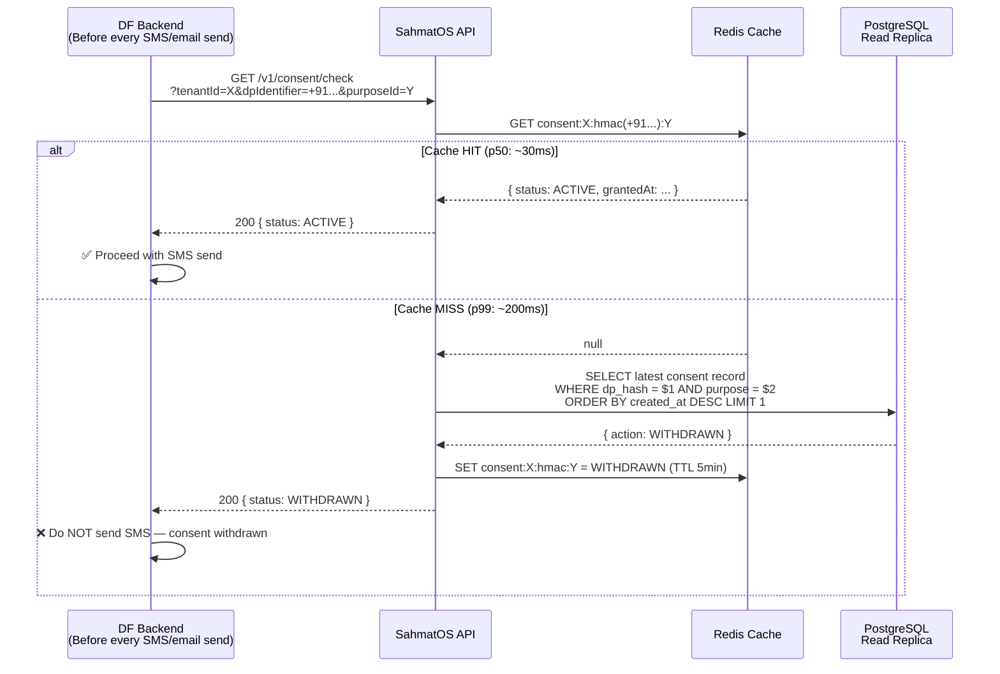
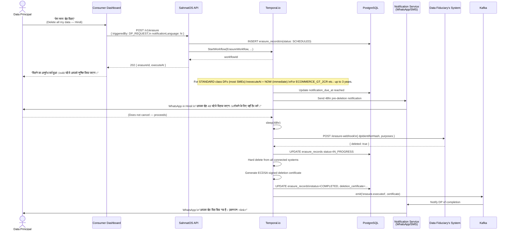
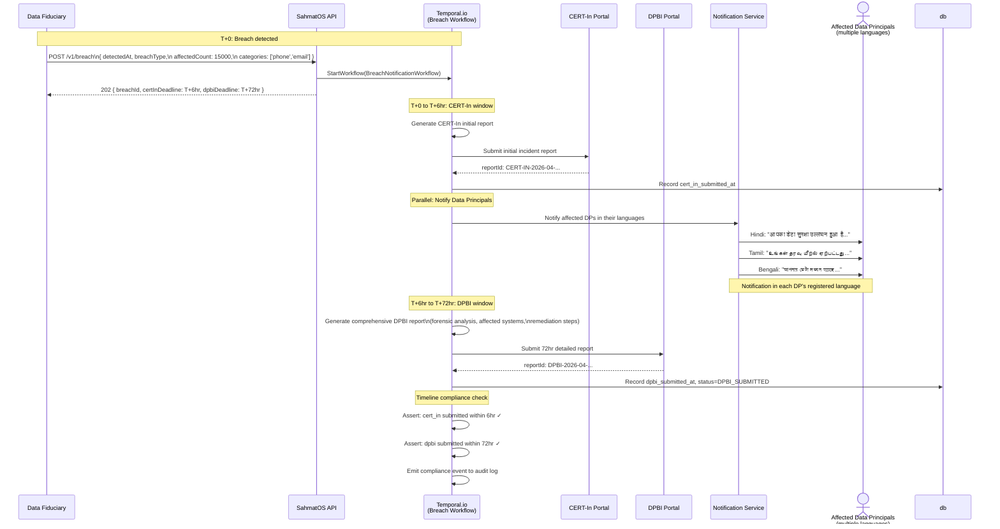

# API Sequence Diagrams — SahmatOS

## 1. Data Fiduciary Integration Flow (Day 1 Onboarding)

---

## 2. Consent Collection via Widget (Web)

---

## 3. Real-Time Consent Check (High-Frequency API)

---

## 4. Erasure Request Flow

---

## 5. Breach Notification Workflow (Rule 7)

