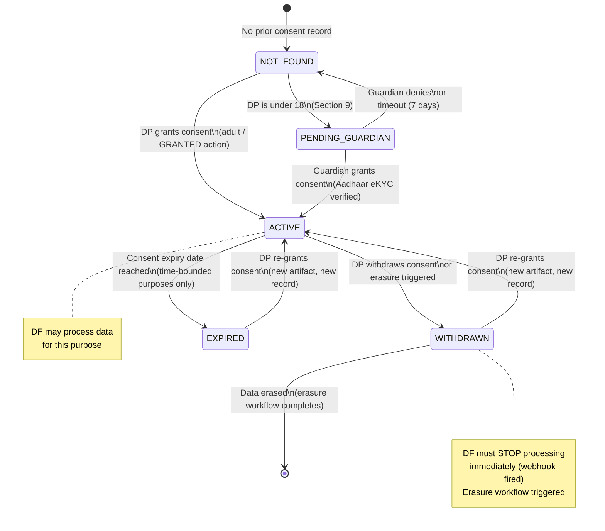
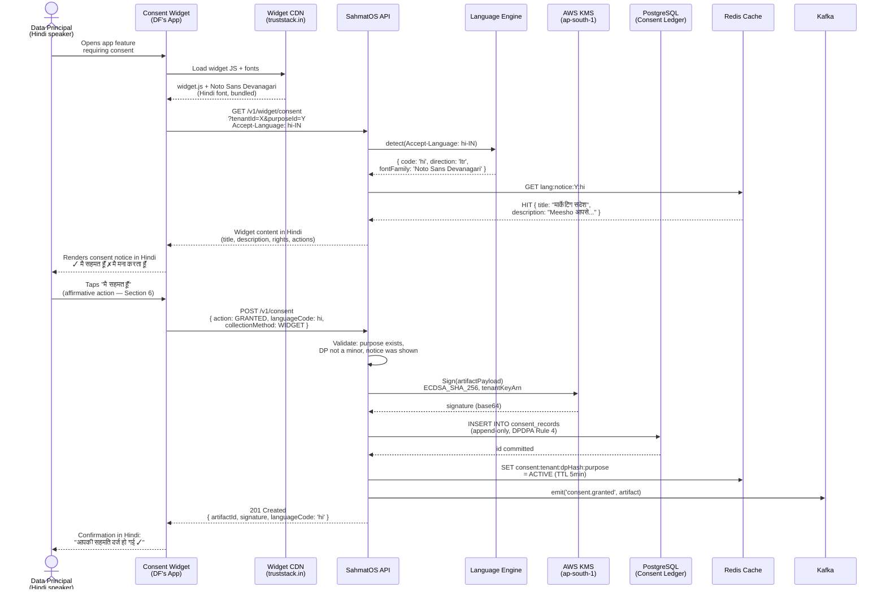
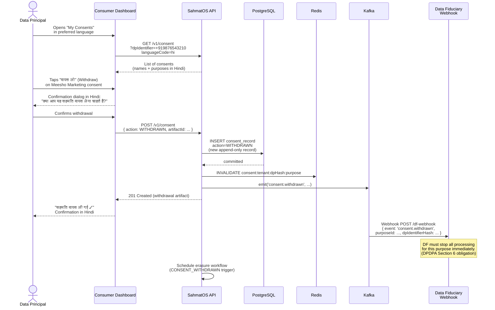
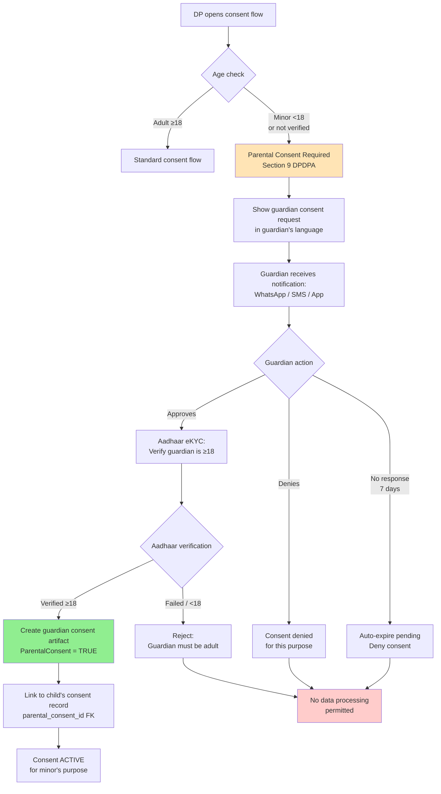

# Consent Lifecycle Diagrams — SahmatOS

## 1. Consent State Machine

---

## 2. Consent Grant Flow (Happy Path)

---

## 3. Consent Withdrawal Flow

---

## 4. Parental Consent Flow (Section 9)

