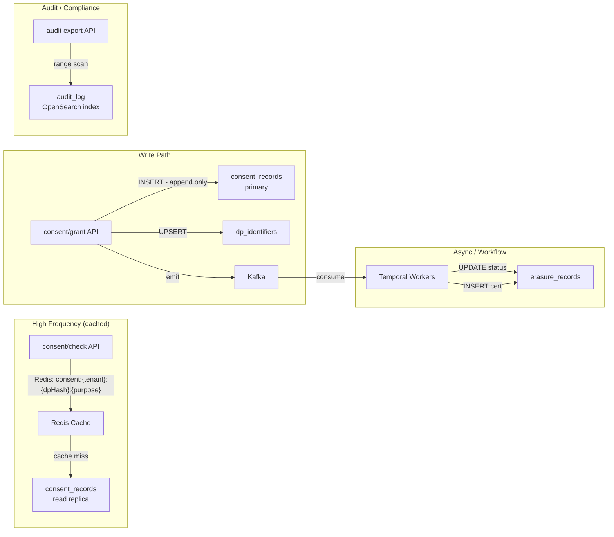

# Entity-Relationship Diagram — SahmatOS Data Model

```mermaid
erDiagram
    TENANTS {
        uuid id PK
        text name
        text legal_name
        text cin
        text df_class "ECOMMERCE_GT_2CR | GAMING_GT_50L | SOCIAL_GT_2CR | STANDARD"
        text default_language "BCP 47"
        text kms_symmetric_key_arn
        text kms_signing_key_arn
        text plan
        timestamptz created_at
        text data_residency_region "ap-south-1 | asia-south1"
    }

    CONSENT_PURPOSES {
        uuid id PK
        uuid tenant_id FK
        text code "e.g. marketing_sms"
        int version
        bool is_current
        text[] data_categories
        text[] processing_activities
        text retention_period
        int retention_days
        bool is_sensitive
        bool requires_parental_consent
        jsonb translation_status "per-language: pending|approved"
        bool shares_with_third_parties
        timestamptz approved_at
    }

    CONSENT_PURPOSE_TRANSLATIONS {
        uuid id PK
        uuid purpose_id FK
        text language_code "BCP 47 with script: hi, ta, ks-Arab, mni-Mtei"
        text title "Purpose name in this language"
        text description "Full notice text (≤300 words)"
        text data_categories_text
        text your_rights_text
        text withdrawal_text
        text status "pending|reviewed|approved|rejected"
        text text_direction "ltr | rtl"
        text script_code "Deva, Tamil, Arab, Mtei, Olck..."
        text font_family
        timestamptz approved_at
    }

    CONSENT_RECORDS {
        uuid id PK
        uuid tenant_id FK
        uuid purpose_id FK
        text dp_identifier_hash "HMAC-SHA256 — never raw PII"
        text action "GRANTED | WITHDRAWN | EXPIRED"
        text collection_method "WIDGET | API | WHATSAPP | VERBAL_AADHAAR"
        text language_code "BCP 47 — language at consent time"
        int notice_version "Purpose translation version shown"
        jsonb consent_artifact "Signed payload"
        text signature "ECDSA P-256 base64"
        text signature_key_id "AWS KMS key ARN"
        text ip_address_hash "SHA-256 — never raw IP"
        bool is_minor
        uuid parental_consent_id FK "Self-ref — links minor to guardian consent"
        text guardian_id_hash
        timestamptz expires_at
        jsonb channel_evidence "WhatsApp WABA ID, message ID, receipt"
        timestamptz created_at "APPEND-ONLY — no UPDATE/DELETE"
        text data_residency_region
    }

    DP_IDENTIFIERS {
        uuid id PK
        uuid tenant_id FK
        text identifier_hash "Must match consent_records.dp_identifier_hash"
        text identifier_encrypted "AES-256 via tenant KMS key"
        text identifier_type "phone | email | user_id | aadhaar_virtual_id"
        text preferred_language "BCP 47"
        bool age_verified
        bool is_minor
        text guardian_identifier_hash "Self-ref: links minor to guardian"
        bool has_consumer_account
        uuid consumer_account_id FK
        timestamptz created_at
    }

    ERASURE_RECORDS {
        uuid id PK
        uuid tenant_id FK
        text dp_identifier_hash
        uuid purpose_id FK
        text triggered_by "CONSENT_WITHDRAWN | PURPOSE_FULFILLED | DP_REQUEST | CLASS_TIMELINE"
        text df_class_at_trigger "Snapshot of df_class at trigger time"
        timestamptz triggered_at
        timestamptz notification_due_at "execute_at - 48hr"
        timestamptz notification_sent_at
        timestamptz execute_at "Actual deletion time"
        timestamptz executed_at
        text status "SCHEDULED | NOTIFIED | IN_PROGRESS | COMPLETED | FAILED"
        text notification_language "BCP 47"
        text temporal_workflow_id
        jsonb deletion_certificate
        text deletion_signature "ECDSA P-256"
        jsonb deletion_targets "[{system, status}]"
    }

    BREACH_EVENTS {
        uuid id PK
        uuid tenant_id FK
        timestamptz detected_at
        text detected_by "SYSTEM | TENANT | THIRD_PARTY | DPBI"
        text breach_type
        text breach_description
        text[] affected_data_categories
        int estimated_affected_count
        timestamptz cert_in_deadline "detected_at + 6hr"
        timestamptz dpbi_deadline "detected_at + 72hr"
        timestamptz cert_in_submitted_at
        text cert_in_report_id
        timestamptz dpbi_submitted_at
        text dpbi_report_id
        text status "DETECTED | NOTIFYING | CERT_IN_SUBMITTED | DPBI_SUBMITTED | CLOSED"
        text temporal_workflow_id
    }

    AUDIT_LOG {
        uuid id PK
        uuid tenant_id FK
        text actor_type "SYSTEM | TENANT_API | CONSUMER | ADMIN | TEMPORAL_WORKFLOW"
        text actor_id
        text event_type "consent.granted | erasure.executed | ..."
        text resource_type
        uuid resource_id
        text dp_identifier_hash
        uuid purpose_id
        jsonb event_data
        bigint sequence_number "Per-tenant monotonic"
        text prev_entry_hash "Chain integrity"
        timestamptz created_at "APPEND-ONLY"
    }

    CONSUMER_ACCOUNTS {
        uuid id PK
        text identifier_encrypted "AES-256"
        text identifier_hash "SHA-256 for lookup"
        text identifier_type "phone | email"
        text preferred_language "BCP 47"
        bool truststack_consent
        timestamptz truststack_consent_at
        timestamptz last_active_at
    }

    TENANTS ||--o{ CONSENT_PURPOSES : "defines"
    CONSENT_PURPOSES ||--o{ CONSENT_PURPOSE_TRANSLATIONS : "translated into 22 languages"
    TENANTS ||--o{ CONSENT_RECORDS : "owns (partitioned)"
    CONSENT_PURPOSES ||--o{ CONSENT_RECORDS : "referenced by"
    CONSENT_RECORDS ||--o| CONSENT_RECORDS : "parental_consent_id (minor → guardian)"
    TENANTS ||--o{ DP_IDENTIFIERS : "owns"
    DP_IDENTIFIERS ||--o| DP_IDENTIFIERS : "guardian_identifier_hash (minor → guardian)"
    DP_IDENTIFIERS ||--o| CONSUMER_ACCOUNTS : "may have account"
    TENANTS ||--o{ ERASURE_RECORDS : "owns"
    CONSENT_PURPOSES ||--o{ ERASURE_RECORDS : "targeted by"
    TENANTS ||--o{ BREACH_EVENTS : "reports"
    TENANTS ||--o{ AUDIT_LOG : "logged for"
```

---

## Table Access Patterns

```mermaid
graph LR
    subgraph "High Frequency (cached)"
        A[consent/check API] -->|"Redis: consent:{tenant}:{dpHash}:{purpose}"| B[Redis Cache]
        B -->|"cache miss"| C[consent_records\nread replica]
    end

    subgraph "Write Path"
        D[consent/grant API] -->|"INSERT - append only"| E[consent_records\nprimary]
        D -->|"UPSERT"| F[dp_identifiers]
        D -->|"emit"| G[Kafka]
    end

    subgraph "Async / Workflow"
        G -->|"consume"| H[Temporal Workers]
        H -->|"UPDATE status"| I[erasure_records]
        H -->|"INSERT cert"| I
    end

    subgraph "Audit / Compliance"
        J[audit export API] -->|"range scan"| K[audit_log\nOpenSearch index]
    end
```
