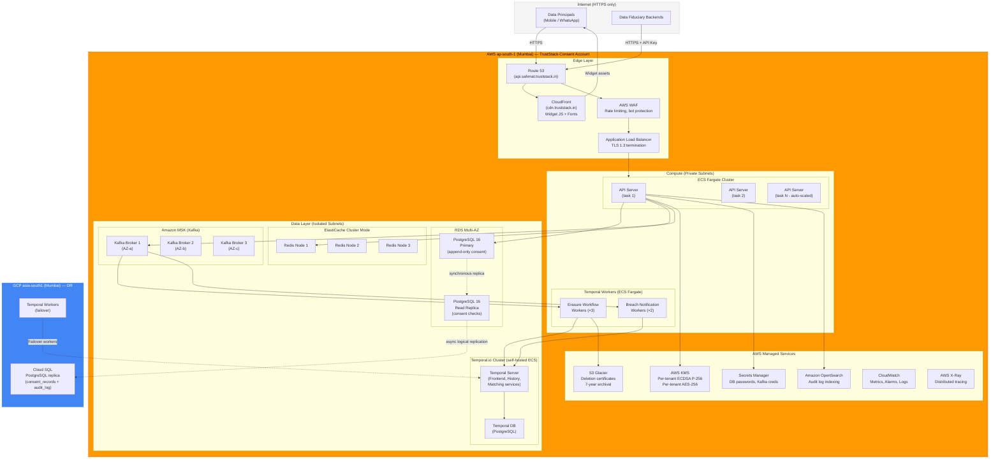
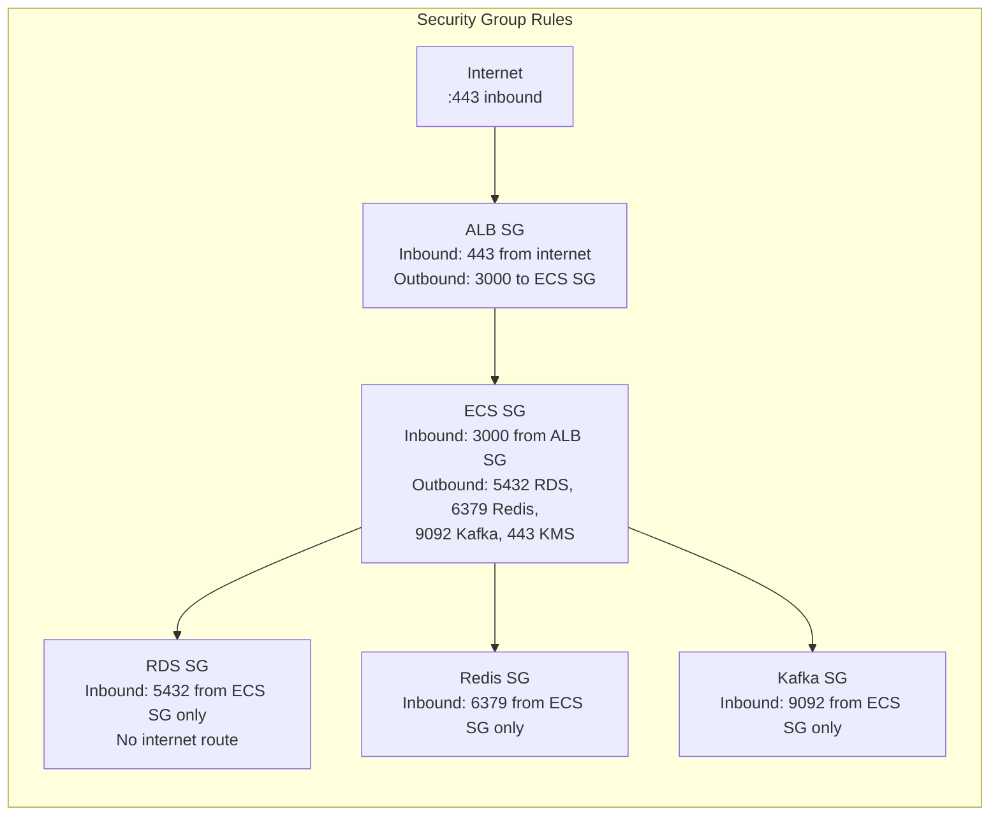
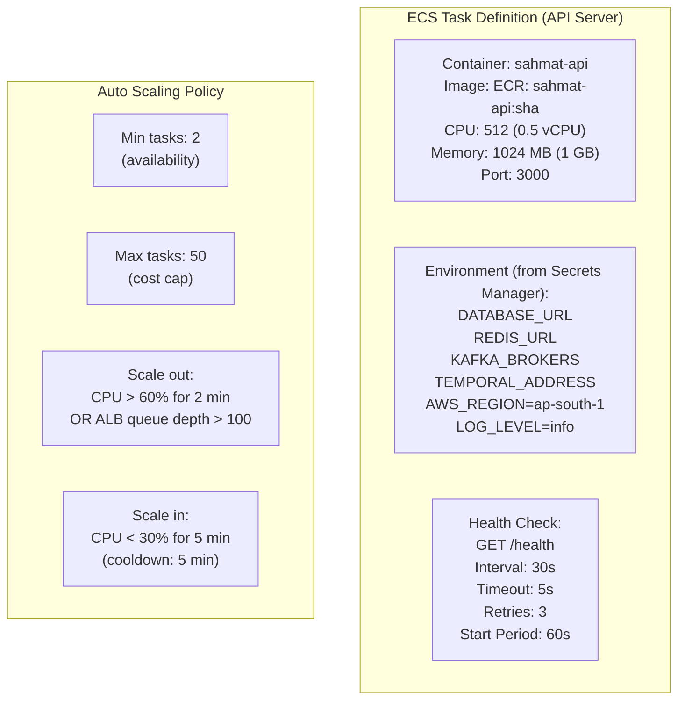

# Deployment Architecture — SahmatOS

## AWS ap-south-1 (Mumbai) — Primary

```mermaid
graph TB
    subgraph internet["Internet (HTTPS only)"]
        users["Data Principals\n(Mobile / WhatsApp)"]
        df_backends["Data Fiduciary Backends"]
    end

    subgraph aws["AWS ap-south-1 (Mumbai) — TrustStack-Consent Account"]
        subgraph edge["Edge Layer"]
            r53["Route 53\n(api.sahmat.truststack.in)"]
            cf["CloudFront\n(cdn.truststack.in)\nWidget JS + Fonts"]
            waf["AWS WAF\nRate limiting, bot protection"]
            alb["Application Load Balancer\nTLS 1.3 termination"]
        end

        subgraph compute["Compute (Private Subnets)"]
            subgraph ecs["ECS Fargate Cluster"]
                api1["API Server\n(task 1)"]
                api2["API Server\n(task 2)"]
                apiN["API Server\n(task N - auto-scaled)"]
            end

            subgraph workers["Temporal Workers (ECS Fargate)"]
                erasure_worker["Erasure Workflow\nWorkers (×3)"]
                breach_worker["Breach Notification\nWorkers (×2)"]
            end
        end

        subgraph data["Data Layer (Isolated Subnets)"]
            subgraph rds["RDS Multi-AZ"]
                postgres_primary["PostgreSQL 16\nPrimary\n(append-only consent)"]
                postgres_replica["PostgreSQL 16\nRead Replica\n(consent checks)"]
            end

            subgraph elasticache["ElastiCache Cluster Mode"]
                redis1["Redis Node 1"]
                redis2["Redis Node 2"]
                redis3["Redis Node 3"]
            end

            subgraph msk["Amazon MSK (Kafka)"]
                kafka_broker1["Kafka Broker 1\n(AZ-a)"]
                kafka_broker2["Kafka Broker 2\n(AZ-b)"]
                kafka_broker3["Kafka Broker 3\n(AZ-c)"]
            end

            subgraph temporal_cluster["Temporal.io Cluster (self-hosted ECS)"]
                temporal_server["Temporal Server\n(Frontend, History,\nMatching services)"]
                temporal_db["Temporal DB\n(PostgreSQL)"]
            end
        end

        subgraph managed_services["AWS Managed Services"]
            kms["AWS KMS\nPer-tenant ECDSA P-256\nPer-tenant AES-256"]
            secrets_mgr["Secrets Manager\nDB passwords, Kafka creds"]
            opensearch["Amazon OpenSearch\nAudit log indexing"]
            s3_certs["S3 Glacier\nDeletion certificates\n7-year archival"]
            cloudwatch["CloudWatch\nMetrics, Alarms, Logs"]
            xray["AWS X-Ray\nDistributed tracing"]
        end
    end

    subgraph gcp["GCP asia-south1 (Mumbai) — DR"]
        gcp_temporal["Temporal Workers\n(failover)"]
        gcp_pg["Cloud SQL\nPostgreSQL replica\n(consent_records + audit_log)"]
    end

    users -->|HTTPS| r53
    df_backends -->|HTTPS + API Key| r53
    r53 --> cf
    r53 --> waf
    waf --> alb
    alb --> ecs
    cf -->|Widget assets| users

    api1 --> postgres_primary
    api1 --> redis1
    api1 --> kafka_broker1
    api1 --> kms
    api1 --> secrets_mgr

    postgres_primary -.->|synchronous replica| postgres_replica
    postgres_replica -.->|async logical replication| gcp_pg

    kafka_broker1 --> erasure_worker
    kafka_broker1 --> breach_worker
    erasure_worker --> temporal_server
    breach_worker --> temporal_server
    temporal_server --> temporal_db

    api1 --> opensearch
    erasure_worker --> s3_certs

    gcp_temporal -.->|Failover workers| temporal_server

    style aws fill:#FF9900,stroke:#FF6600,color:#000
    style gcp fill:#4285F4,stroke:#1A73E8,color:#fff
    style internet fill:#f5f5f5,stroke:#ccc
```

---

## Security Groups and Network ACLs

```mermaid
graph LR
    subgraph sg["Security Group Rules"]
        internet_sg["Internet\n:443 inbound"]
        alb_sg["ALB SG\nInbound: 443 from internet\nOutbound: 3000 to ECS SG"]
        ecs_sg["ECS SG\nInbound: 3000 from ALB SG\nOutbound: 5432 RDS, 6379 Redis,\n9092 Kafka, 443 KMS"]
        rds_sg["RDS SG\nInbound: 5432 from ECS SG only\nNo internet route"]
        redis_sg["Redis SG\nInbound: 6379 from ECS SG only"]
        kafka_sg["Kafka SG\nInbound: 9092 from ECS SG only"]
    end

    internet_sg --> alb_sg
    alb_sg --> ecs_sg
    ecs_sg --> rds_sg
    ecs_sg --> redis_sg
    ecs_sg --> kafka_sg
```

---

## CI/CD Pipeline

```mermaid
flowchart LR
    dev["Developer\nPushes to branch"]
    pr["GitHub Pull Request"]
    ci["CI Pipeline\n(GitHub Actions)\n- lint\n- typecheck\n- test:unit\n- test:integration\n- test:lang (22 languages)\n- npm audit\n- semgrep SAST\n- docker build"]
    review["Code Review\n(2 approvals required\nfor main branch)"]
    main["Merge to main"]
    build_img["Build Docker Image\nTag: git SHA"]
    push_ecr["Push to ECR\n(ap-south-1)"]
    deploy_dev["Deploy to Dev\n(auto)\nRun migrations"]
    smoke_dev["Smoke Tests\n/health + consent check"]
    approve_staging["Manual Approval\n(team lead)"]
    deploy_staging["Deploy to Staging\nRun migrations"]
    staging_tests["Integration + Load Tests\n(k6 at 10,000 rps)"]
    approve_prod["Manual Approval\n(CTO + Compliance)"]
    deploy_prod["Deploy to Production\n(Blue/Green)\nRun migrations"]
    smoke_prod["Post-Deploy Smoke Tests\nRollback if fails"]

    dev --> pr --> ci --> review --> main --> build_img --> push_ecr
    push_ecr --> deploy_dev --> smoke_dev --> approve_staging
    approve_staging --> deploy_staging --> staging_tests --> approve_prod
    approve_prod --> deploy_prod --> smoke_prod
```

---

## Container Configuration

```mermaid
graph TB
    subgraph ecs_task["ECS Task Definition (API Server)"]
        container["Container: sahmat-api\nImage: ECR: sahmat-api:sha\nCPU: 512 (0.5 vCPU)\nMemory: 1024 MB (1 GB)\nPort: 3000"]

        env_vars["Environment (from Secrets Manager):\nDATABASE_URL\nREDIS_URL\nKAFKA_BROKERS\nTEMPORAL_ADDRESS\nAWS_REGION=ap-south-1\nLOG_LEVEL=info"]

        healthcheck["Health Check:\nGET /health\nInterval: 30s\nTimeout: 5s\nRetries: 3\nStart Period: 60s"]
    end

    subgraph auto_scaling["Auto Scaling Policy"]
        min["Min tasks: 2\n(availability)"]
        max["Max tasks: 50\n(cost cap)"]
        scale_out["Scale out:\nCPU > 60% for 2 min\nOR ALB queue depth > 100"]
        scale_in["Scale in:\nCPU < 30% for 5 min\n(cooldown: 5 min)"]
    end
```
