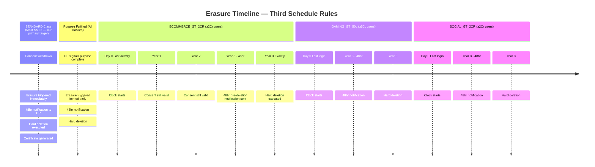
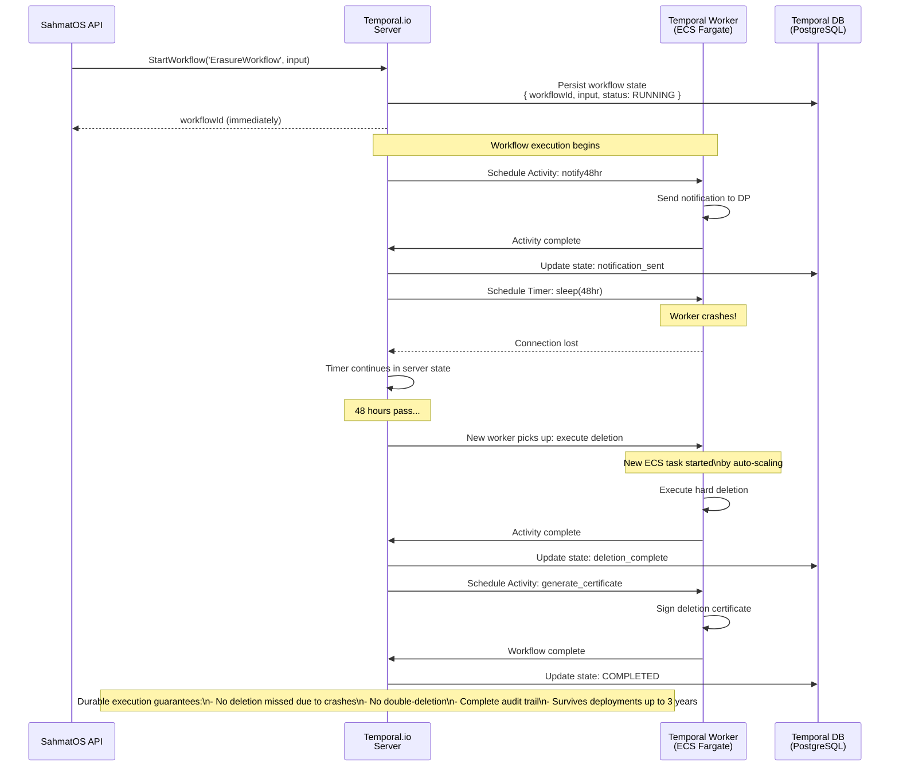

# Erasure and Breach Workflows — SahmatOS

## 1. Erasure Workflow (Temporal.io)

```mermaid
flowchart TD
    START([Erasure Triggered]) --> TRIGGER_TYPE{What triggered erasure?}

    TRIGGER_TYPE -->|Consent withdrawn| WITHDRAWN[CONSENT_WITHDRAWN\nImmediate execution for STANDARD class]
    TRIGGER_TYPE -->|Purpose fulfilled| FULFILLED[PURPOSE_FULFILLED\nImmediate for STANDARD class]
    TRIGGER_TYPE -->|DP direct request| DP_REQ[DP_REQUEST\nImmediate for all classes]
    TRIGGER_TYPE -->|Class timeline expired| CLASS[CLASS_TIMELINE\n3yr reached for ECOMMERCE/GAMING/SOCIAL]

    WITHDRAWN --> CLASS_CHECK{Determine DF class\n(Third Schedule)}
    FULFILLED --> CLASS_CHECK
    DP_REQ --> CLASS_CHECK
    CLASS --> EXECUTE_NOW[Execute immediately\n48hr notification still required]

    CLASS_CHECK -->|ECOMMERCE_GT_2CR| SCHEDULE_3YR[Schedule: 3yr from last transaction/login]
    CLASS_CHECK -->|GAMING_GT_50L| SCHEDULE_3YR
    CLASS_CHECK -->|SOCIAL_GT_2CR| SCHEDULE_3YR
    CLASS_CHECK -->|STANDARD| SCHEDULE_NOW[Schedule: immediate]

    SCHEDULE_3YR --> TEMPORAL_SLEEP[Temporal.io sleep\nup to 3 years\nDurable across restarts/deployments]
    SCHEDULE_NOW --> NOTIFY_48HR
    TEMPORAL_SLEEP -->|48hr before deletion| NOTIFY_48HR

    NOTIFY_48HR[Send 48hr pre-deletion notification\nto DP in their language] --> WAIT_48HR[Wait 48 hours\nDP may cancel]

    WAIT_48HR --> CANCEL_CHECK{DP requested\ncancellation?}
    CANCEL_CHECK -->|Yes| CANCELLED([Erasure cancelled\nConsent can be re-granted])
    CANCEL_CHECK -->|No| EXECUTE_DELETION

    EXECUTE_DELETION[Execute hard deletion] --> PROPAGATE[Propagate to all connected systems]

    PROPAGATE --> PROP1[Delete from tenant's database\nvia Erasure API endpoint]
    PROPAGATE --> PROP2[Delete from Razorpay\nKYC + payment data]
    PROPAGATE --> PROP3[Delete from Tally\nfinancial records]
    PROPAGATE --> PROP4[Delete from Zoho\nCRM/Books/Desk]
    PROPAGATE --> PROP5[Delete from WhatsApp Business\nchat history + opt-in]

    PROP1 --> VERIFY
    PROP2 --> VERIFY
    PROP3 --> VERIFY
    PROP4 --> VERIFY
    PROP5 --> VERIFY

    VERIFY[Verify deletion across all systems] --> GEN_CERT[Generate ECDSA-signed\ndeletion certificate]
    GEN_CERT --> STORE_CERT[Store certificate:\n- PostgreSQL erasure_records\n- S3 Glacier 7yr archive]
    STORE_CERT --> KAFKA_EMIT[emit erasure.executed to Kafka]
    KAFKA_EMIT --> NOTIFY_DP[Send completion notification\nto DP in their language]
    NOTIFY_DP --> DONE([Erasure Complete ✓])

    EXECUTE_NOW --> NOTIFY_48HR

    style CANCELLED fill:#ffe4b5
    style DONE fill:#90EE90
```

---

## 2. Erasure Timeline by Data Fiduciary Class (Third Schedule)



---

## 3. Breach Notification Workflow (Rule 7, Temporal.io)

```mermaid
flowchart TD
    START([Breach Detected]) --> LOG[Log breach event\nimmutable audit entry\nTimestamp: T+0]

    LOG --> SCOPE_ASSESS[Assess breach scope:\n- What data affected?\n- How many DPs?\n- What categories?]

    SCOPE_ASSESS --> PARALLEL_NOTIFY[Parallel actions]

    PARALLEL_NOTIFY --> CERT_IN_TRACK[CERT-In Track\nDeadline: T+6hr]
    PARALLEL_NOTIFY --> DP_NOTIFY[DP Notification Track]
    PARALLEL_NOTIFY --> DPBI_TRACK[DPBI Track\nDeadline: T+72hr]

    subgraph cert_in_flow["CERT-In Flow (⚡ 6hr window)"]
        CERT_IN_TRACK --> GEN_INITIAL[Generate initial incident report\n- Date/time of incident\n- Nature of incident\n- Systems affected\n- Interim measures taken]
        GEN_INITIAL --> SUBMIT_CERT_IN[Submit to CERT-In portal\n(www.cert-in.org.in)]
        SUBMIT_CERT_IN --> CERT_IN_DONE[Record cert_in_submitted_at\ncert_in_report_id]
    end

    subgraph dp_flow["Data Principal Notifications"]
        DP_NOTIFY --> IDENTIFY_DPS[Identify all affected DPs\nby data category + scope]
        IDENTIFY_DPS --> LANG_DETECT[Detect each DP's language\nfrom dp_identifiers.preferred_language]
        LANG_DETECT --> SEND_NOTIF[Send in DP's native language:\nHindi: 'आपका डेटा प्रभावित हुआ है...'\nTamil: 'உங்கள் தரவு பாதிக்கப்பட்டது...'\nUrdu: 'آپ کا ڈیٹا متاثر ہوا ہے...' (RTL)\n... (all registered languages)]
        SEND_NOTIF --> DP_NOTIF_DONE[Record dp_notification_sent_at\ndp_notification_count]
    end

    subgraph dpbi_flow["DPBI Detailed Report Flow (72hr window)"]
        DPBI_TRACK --> FORENSIC[Forensic analysis:\n- Root cause\n- Data exfiltration evidence\n- Affected systems\n- Remediation actions]
        FORENSIC --> GEN_DPBI_REPORT[Generate comprehensive DPBI report:\n- Incident timeline\n- Affected data categories + counts\n- Technical measures taken\n- Preventive measures planned\n- CERT-In reference number]
        GEN_DPBI_REPORT --> SUBMIT_DPBI[Submit to DPBI portal]
        SUBMIT_DPBI --> DPBI_DONE[Record dpbi_submitted_at\ndpbi_report_id]
    end

    CERT_IN_DONE --> COMPLIANCE_CHECK
    DP_NOTIF_DONE --> COMPLIANCE_CHECK
    DPBI_DONE --> COMPLIANCE_CHECK

    COMPLIANCE_CHECK{All deadlines met?} -->|Yes| CLOSE[Close breach event\nstatus = CLOSED\nAudit entry complete]
    COMPLIANCE_CHECK -->|No| ESCALATE[ESCALATE:\n- Alert compliance officer\n- Log missed deadline\n- Notify DPBI of delay]

    CLOSE --> DONE([Breach Response Complete ✓\nAll Rule 7 obligations met])

    style CERT_IN_TRACK fill:#ffe4b5,stroke:#ff9900
    style DPBI_TRACK fill:#ffe4b5,stroke:#ff9900
    style DP_NOTIFY fill:#e6f3ff,stroke:#4499ff
    style DONE fill:#90EE90
    style ESCALATE fill:#ffcccb
```

---

## 4. Temporal.io Workflow Durability Model


