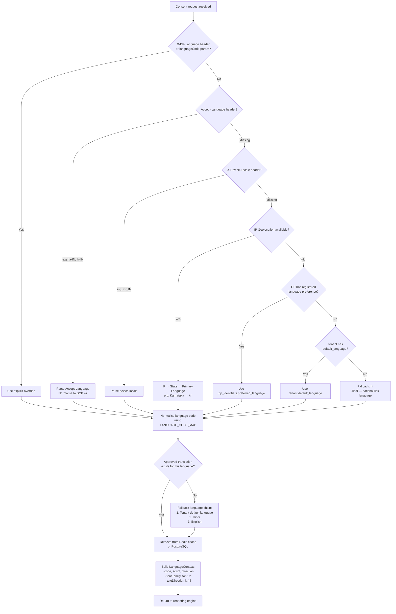
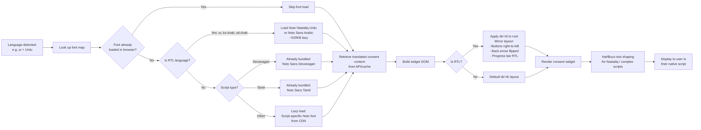
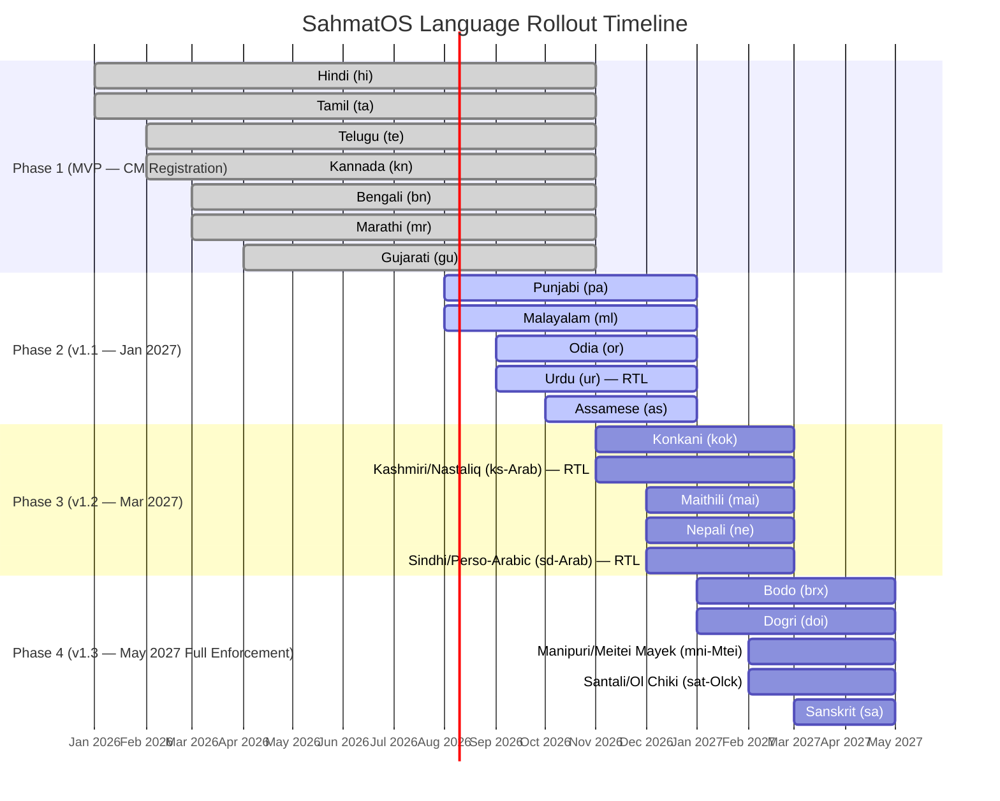
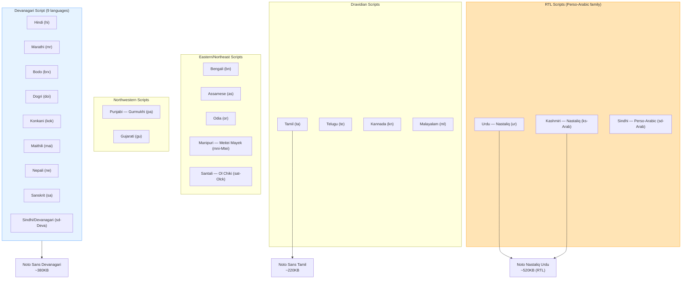

# Indic Language Detection and Rendering Flow — SahmatOS

## 1. Language Detection Pipeline



---

## 2. Consent Widget Rendering Pipeline



---

## 3. Translation Quality Pipeline

```mermaid
flowchart TD
    A[DF defines new Purpose\nin English] --> B[Template Engine\ngenerates English base text]

    B --> C[On-premise LLM\nfine-tuned for legal Indic translation\nHosted: AWS Mumbai]

    C --> D[Translates to all 22 languages\nin parallel]

    D --> E{Quality threshold check:\n- Legal term accuracy score\n- Reading level ≤ 6th grade\n- Length within bounds}

    E -->|Pass| F[Enter Human Review Queue]
    E -->|Fail| G[Flag for re-translation\nwith quality notes]
    G --> C

    F --> H[Native speaker review\n(per language):\n- Terminology accuracy\n- Cultural appropriateness\n- Clarity check]

    H --> I{Reviewer decision}

    I -->|Approved| J[Legal review\n(language-qualified lawyer\nper language group)]
    I -->|Rejected + notes| G

    J --> K{Legal decision}
    K -->|Approved| L[Mark translation: status=approved\nin consent_purpose_translations]
    K -->|Needs revision| M[Return to translator\nwith legal notes]
    M --> C

    L --> N[Translation available\nfor production use]

    N --> O[Cache in Redis:\nlang:notice:{purposeId}:{langCode}\nTTL: 24hr]

    O --> P[Served to users\nin their language]
```

---

## 4. Language Coverage Status and Rollout



---

## 5. Script Coverage Map


