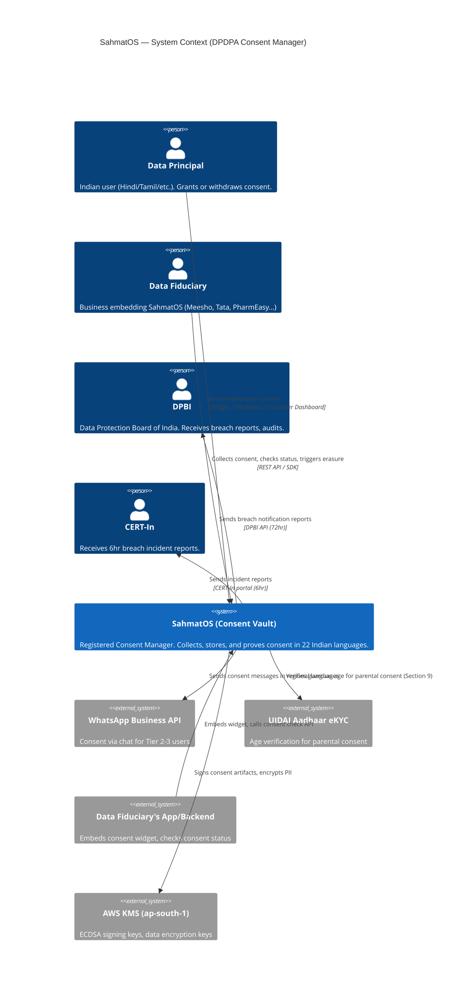
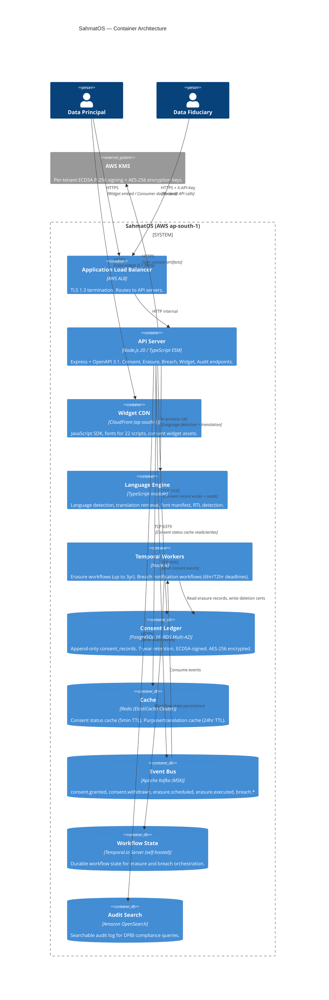

# System Architecture Diagram — SahmatOS



---



---

```mermaid
graph TB
    subgraph dual_role["Dual-Role Isolation (DPDPA Section 2(g))"]
        subgraph consent_account["AWS Account: TrustStack-Consent"]
            sahmat["SahmatOS\n(Consent Vault)"]
            consent_db[("Consent Ledger\nPostgreSQL")]
            sahmat --> consent_db
        end

        subgraph discovery_account["AWS Account: TrustStack-Discovery"]
            discovery["Module 2\n(AI Discovery Engine)"]
            discovery_db[("Discovery Data\nSeparate DB)"]
            discovery --> discovery_db
        end

        consent_account -. "NO VPC PEERING\nNO SHARED RESOURCES\nNO IAM CROSS-ACCOUNT" .- discovery_account
    end

    note["DPDPA: Consent Manager\nCANNOT be Data Processor\nfor same Data Principal"]
    style note fill:#ff9999,stroke:#cc0000
```
