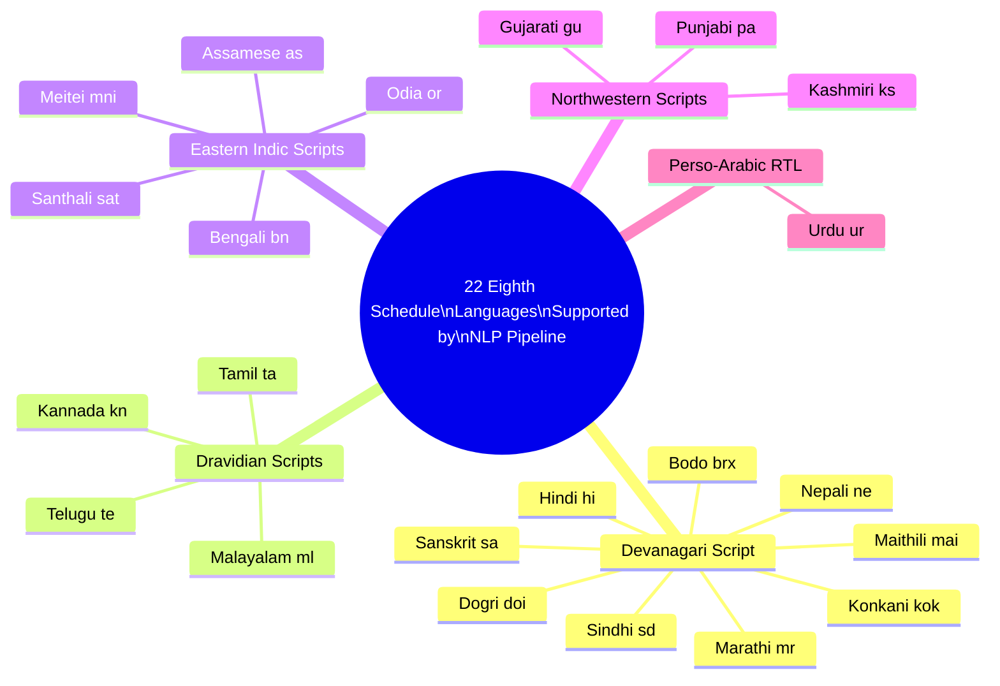

# Module 2 — NLP Contract Audit: Pipeline Flow

This document covers the complete lifecycle of a vendor contract from upload to signed DPA, and provides a reference for the 22 Indian language coverage supported by the audit pipeline.

---

## NLP Contract Audit Pipeline

The Contract Audit pipeline processes vendor contracts and Data Processing Agreements (DPAs) in any of the 22 languages listed in the Eighth Schedule of the Indian Constitution. The pipeline runs as an async job — the DPO uploads the document, receives a job ID, and polls for completion. For large scanned contracts, OCR can add several minutes to total processing time.

The pipeline produces two outputs:
- A **Compliance Audit Report** listing all clauses found, which DPDPA provisions they map to, and any gaps or violations with severity ratings.
- An optionally generated **Compliant DPA** in the original contract language, signed with the tenant's ECDSA key, which can be shared with the vendor for signing.

```mermaid
flowchart TD
    START([DPO / Legal uploads contract\nPDF / DOCX / Scanned Image\nvia Discovery API\nPOST /v1/contracts/upload]) --> FP

    FP["Stage 1: FileProcessor\nExtract text from PDF/DOCX\nDetect if image-based scan\nCompute confidence score for\nextracted text coverage"]

    FP --> CONF{Text extraction\nconfidence ≥ 0.80?}

    CONF -->|"Yes — digital PDF/DOCX\ntext layer present"| LANG_DET
    CONF -->|"No — scanned image\nor low-quality PDF"| OCR

    OCR["Stage 2: OCRAgent\nTesseract 5.x with Indic language packs:\nDevanagari, Tamil, Telugu, Kannada,\nMalayalam, Bengali, Gujarati, Odia,\nGurmukhi, Perso-Arabic\nOutput: extracted text + per-page confidence scores"]

    OCR --> OCR_CONF{OCR confidence\n≥ 0.75?}

    OCR_CONF -->|"≥ 0.75 — acceptable quality\nContinue with warning"| OCR_WARN[Attach warning flag to audit:\nMARKED_FOR_MANUAL_REVIEW\nConfidence: {score}%\nNotify DPO in report]
    OCR_CONF -->|"< 0.75 — too low to trust"| OCR_FAIL[Return error to DPO:\nOCR_QUALITY_INSUFFICIENT\nRequest higher-quality scan\nPause audit job]

    OCR_WARN --> LANG_DET

    LANG_DET["Stage 3: LanguageDetector\nRun language detection on full document\nand per-page (handles code-switching)\nModels: langdetect + fastText multilingual\nOutput: primary_language, secondary_languages[],\ncode_switch_detected: bool"]

    LANG_DET --> CODE_SW{Code-switching\ndetected?\ne.g., Hindi headings\n+ English clauses}

    CODE_SW -->|"Yes — multi-language document"| CODE_SW_Y[Flag: MULTILINGUAL_CONTRACT\nSegment document by language\nRun translation per segment separately]
    CODE_SW -->|"No — single language"| TRANS_CHECK

    CODE_SW_Y --> TRANS_CHECK
    TRANS_CHECK{Primary language\nis English?}

    TRANS_CHECK -->|"Yes — no translation needed"| CLAUSE_EX
    TRANS_CHECK -->|"No — translate to English\nfor compliance analysis"| TRANS

    TRANS["Stage 4: TranslationAgent\nOn-premise NLLB-200 model (ap-south-1)\n22 Eighth Schedule languages → English\nPreserve original text in parallel\nTag: original_language for DPA output later\nDo NOT send to external translation APIs"]

    TRANS --> CLAUSE_EX

    CLAUSE_EX["Stage 5: ClauseExtractor\nBERT-multilingual fine-tuned on Indian legal text\nSegment document into typed clauses:\n• PURPOSE — what data is collected and why\n• RETENTION — how long data is kept\n• SHARING — third parties data is shared with\n• CROSS_BORDER — data transfers outside India\n• BREACH_NOTIFICATION — breach response obligations\n• DP_RIGHTS — Data Principal rights (access, correction, erasure)\n• DATA_CATEGORIES — types of personal data processed\n• GOVERNING_LAW — jurisdiction and applicable law"]

    CLAUSE_EX --> COMP_CHECK

    subgraph COMP_CHECK["Stage 6: ComplianceChecker — DPDPA Taxonomy"]
        CC_PURPOSE{"PURPOSE clause:\nContains 'any purpose'\nor open-ended language?"}
        CC_PURPOSE -->|"Yes"| CC_P_FAIL["Flag: DATA_SHARING_UNLIMITED\nSeverity: CRITICAL\nDPDPA Section 6(2): Consent must be\nspecific per purpose — blanket clauses void"]
        CC_PURPOSE -->|"No — specific purposes stated"| CC_BREACH

        CC_BREACH{"BREACH_NOTIFICATION\nclause present?"}
        CC_BREACH -->|"Absent"| CC_B_FAIL["Flag: MISSING_BREACH_SLA\nSeverity: CRITICAL\nDPDPA Rule 7: Vendor must notify Data Fiduciary\nwithin 6hr of breach (CERT-In chain)"]
        CC_BREACH -->|"Present"| CC_CROSS

        CC_CROSS{"CROSS_BORDER clause\npresent without\nDPBI authorization ref?"}
        CC_CROSS -->|"Yes — unauthorized"| CC_CB_FAIL["Flag: CROSS_BORDER_UNAUTHORIZED\nSeverity: HIGH\nDPDPA Section 16: DPBI must be able\nto access consent logs on foreign infra"]
        CC_CROSS -->|"No cross-border / DPBI ref present"| CC_RET

        CC_RET{"RETENTION clause:\n'as long as necessary'\nor no fixed period?"}
        CC_RET -->|"Yes — indefinite retention"| CC_R_FAIL["Flag: RETENTION_INDEFINITE\nSeverity: HIGH\nDPDPA: Retention must end when purpose fulfilled\nSMEs: erase when purpose done or consent withdrawn"]
        CC_RET -->|"Fixed period stated"| CC_RIGHTS

        CC_RIGHTS{"DP_RIGHTS clause\npresent?\n(access, correction, erasure,\nnomination)"}
        CC_RIGHTS -->|"Absent"| CC_DR_FAIL["Flag: MISSING_DP_RIGHTS_CLAUSE\nSeverity: MEDIUM\nDPDPA Sections 11–14: Vendor DPA must\nacknowledge Data Principal rights"]
        CC_RIGHTS -->|"Present"| CC_PASS["All core checks passed\ncompute_final_status = COMPLIANT"]
    end

    CC_P_FAIL & CC_B_FAIL & CC_CB_FAIL & CC_R_FAIL & CC_DR_FAIL & CC_PASS --> GAP

    GAP["Stage 7: GapAnalyzer\nProduce gap matrix:\nRequired DPDPA provisions × Present / Absent\nCount CRITICAL / HIGH / MEDIUM / LOW flags\nCompute overall_compliance_score (0–100)\nGenerate remediation guidance per gap"]

    GAP --> CRITICAL_CHECK{Any CRITICAL\nflags present?}

    CRITICAL_CHECK -->|"Yes"| CRITICAL_ALERT[Immediate alert to DPO:\nEmail + in-app notification\nList CRITICAL findings with clause refs\nOffer DPA generation to remediate]
    CRITICAL_CHECK -->|"No"| DPA_DECISION

    CRITICAL_ALERT --> DPA_DECISION
    DPA_DECISION{All clauses\nfully compliant?\nScore = 100}

    DPA_DECISION -->|"Yes — fully compliant"| CERT[Generate Certificate of Compliance\nECDSA-signed PDF\nStored in Artifact Store\nDownloadable by DPO]

    DPA_DECISION -->|"No — gaps or violations found"| DPA_GEN

    DPA_GEN["Stage 8: DPAGenerator\nFill compliant DPA template:\n• Replace non-compliant clauses with DPDPA-compliant equivalents\n• Insert missing required provisions\n• Generate in original_language of contract\n  (or English if language unsupported for generation)\n• Map flagged clauses to remediation language\n• On-premise Mistral 7B generates legal text\n  grounded on TrustStack-maintained clause library"]

    DPA_GEN --> SIGNER

    SIGNER["Stage 9: ECDSA Signer\nSign DPA document with tenant KMS key (ECDSA P-256)\nStore signed artifact in S3 (AES-256-SSE)\nWrite dpa_generations record to Discovery DB\nInclude: audit_id, language, signature, signed_at\nPre-signed S3 URL (15-min expiry) returned to DPO"]

    SIGNER --> FINAL_REPORT[Audit Report finalised\ncontract_audits.status = COMPLETE\noverall_compliance_score persisted\nAll clause findings stored in contract_clauses table]

    FINAL_REPORT --> DONE([DPO downloads:\n• Compliance Audit Report\n• Gap Matrix\n• Signed DPA / Certificate\nvia Discovery API])

    OCR_FAIL --> FAIL_DONE([Audit job status = FAILED\nDPO notified with guidance\nRe-upload with better scan])

    %% Styling
    classDef critical fill:#cc2200,color:#fff,stroke:#991100
    classDef high fill:#dd6600,color:#fff,stroke:#aa4400
    classDef medium fill:#b8860b,color:#fff,stroke:#8b6508
    classDef pass fill:#1e8449,color:#fff,stroke:#196f3d
    classDef info fill:#1a5276,color:#fff,stroke:#154360
    classDef warn fill:#7d3c98,color:#fff,stroke:#6c3483

    class CC_P_FAIL,CC_B_FAIL,CRITICAL_ALERT critical
    class CC_CB_FAIL,CC_R_FAIL high
    class CC_DR_FAIL medium
    class CC_PASS,CERT pass
    class SIGNER,GAP info
    class OCR_WARN,OCR_FAIL warn
```

---

## Compliance Check Summary Table

| Flag | Clause Type | Severity | DPDPA Reference | Auto-remediation in DPA |
|---|---|---|---|---|
| `DATA_SHARING_UNLIMITED` | PURPOSE | CRITICAL | Section 6(2) — consent specific per purpose | Replace with purpose-enumerated clause |
| `MISSING_BREACH_SLA` | BREACH_NOTIFICATION | CRITICAL | Rule 7 — 6hr CERT-In, 72hr DPBI | Insert standard breach notification schedule |
| `CROSS_BORDER_UNAUTHORIZED` | CROSS_BORDER | HIGH | Section 16 — DPBI access required | Add DPBI access commitment + data residency clause |
| `RETENTION_INDEFINITE` | RETENTION | HIGH | DPDPA / Third Schedule class timelines | Replace with class-specific retention period |
| `MISSING_DP_RIGHTS_CLAUSE` | DP_RIGHTS | MEDIUM | Sections 11–14 — access, correction, erasure, nomination | Insert standard DP rights acknowledgement clause |

---

## Language Coverage: 22 Eighth Schedule Languages

The OCR, language detection, and translation pipeline supports all 22 languages listed in the Eighth Schedule of the Indian Constitution. Languages are grouped by script family below, which maps directly to which Tesseract language packs and translation model weights are loaded.



### Script Family — Pipeline Implications

| Script Family | Languages | OCR Pack | Translation Model | RTL Rendering |
|---|---|---|---|---|
| Devanagari | Hindi, Sanskrit, Marathi, Nepali, Konkani, Bodo, Dogri, Maithili, Sindhi | `hin + san + mar` Tesseract packs | NLLB-200 | No |
| Dravidian | Tamil, Telugu, Kannada, Malayalam | `tam + tel + kan + mal` Tesseract packs | NLLB-200 | No |
| Eastern Indic | Bengali, Assamese, Odia, Meitei, Santhali | `ben + asm + ori` Tesseract packs; Meitei/Santhali: transliterate first | NLLB-200 | No |
| Northwestern | Punjabi (Gurmukhi), Gujarati, Kashmiri | `pan + guj + kas` Tesseract packs | NLLB-200 | No |
| Perso-Arabic | Urdu | `urd` Tesseract pack + BiDi text processing | NLLB-200 | Yes — BiDi layout engine required |

### Code-switching Handling

Mixed-language contracts (most common: Hindi headings + English legal clauses, or Tamil party names + English terms) are handled by:

1. **LanguageDetector** segments the document at paragraph level and assigns a language tag to each segment.
2. **TranslationAgent** translates only non-English segments, preserving English segments verbatim.
3. **ClauseExtractor** operates on the reassembled English-normalised document.
4. **DPAGenerator** outputs the final DPA in the contract's primary language, with English translations of inserted clauses for clarity.

---

## Pipeline Design Decisions

| Decision | Rationale |
|---|---|
| On-premise NLLB-200 for translation | Contracts contain vendor names, financial terms, and DP categories; sending to external translation APIs would be a data transfer violation under DPDPA Section 16 |
| BERT-multilingual for clause segmentation | Legal clause boundaries in Indian-language contracts do not align with English sentence boundaries; a multilingual model handles Devanagari and Dravidian syntactic structures correctly |
| Confidence gate at 0.75 for OCR | Below this threshold, character recognition errors in legal text (e.g., misreading a clause number or date) could produce a false "compliant" result; manual review is safer |
| Original language preserved throughout | DPDPA Section 5 requires notices in the user's interface language; a DPA generated only in English may not satisfy a vendor whose Data Principals receive notices in Tamil |
| ECDSA P-256 signature on DPA | Provides non-repudiation: the tenant can prove to DPBI that a specific DPA was generated by TrustStack at a specific point in time with the content audited |
