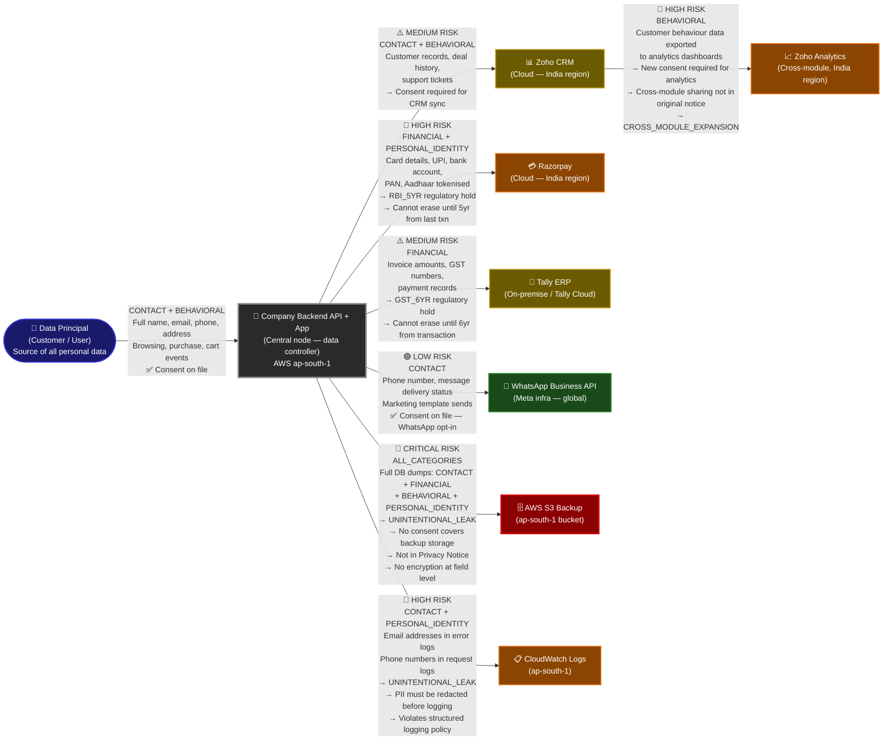

# Module 2 — Data Flow Map: Example Output

This document shows what the **Data Flow Map** product output looks like for a real tenant. This is **not** an architecture diagram — it is a sample of the visualisation that TrustStack generates for a customer after a discovery scan completes.

The example tenant is a 200-person D2C (Direct-to-Consumer) brand operating in India, with integrations across Zoho, Razorpay, Tally, WhatsApp, and AWS. This profile is representative of the typical TrustStack Assessment tier customer.

---

## Example: D2C Brand — Data Flow Map (Post-Scan Output)

The graph below shows every system that holds or processes the Data Principal's personal data, the categories of data flowing to each system, the risk level assessed by the Discovery Engine, and any regulatory flags raised. This map is generated by the `Data Flow Map Service` (Python/NetworkX) and rendered as an interactive graph in the TrustStack dashboard.

Edge labels follow the format: `[RISK] DATA_CATEGORIES — FLAG (if any)`.

---

## Risk Legend

| Risk Level | Colour | Meaning | Typical Remediation SLA |
|---|---|---|---|
| CRITICAL | Red | Data flowing without any consent basis, or PII in unprotected systems not disclosed in Privacy Notice | Immediate — within 24hr |
| HIGH | Orange | Consent basis exists but data category expansion or regulatory hold creates compliance risk | Within 7 days |
| MEDIUM | Yellow | Consent likely covers the flow but notice language needs updating or consent granularity is insufficient | Within 30 days |
| LOW | Green | Consent on file, purpose clear, retention policy set, no regulatory conflicts | No action needed |

---

## Risk Flag Definitions

| Flag | Triggered When | DPDPA Implication |
|---|---|---|
| `UNINTENTIONAL_LEAK` | PII found in backup storage, logs, analytics exports, or test environments not covered by Privacy Notice | Processing without consent (Section 4). Data Principal never authorised backup storage as a purpose. Must erase or obtain consent. |
| `RBI_5YR` | Financial transaction data in Razorpay or similar payment processor | RBI Circular on payment data retention: minimum 5 years from last transaction. Erasure Engine must respect this hold and skip deletion. |
| `GST_6YR` | GST-liable invoice data in Tally or accounting system | GST Act Section 36: records must be retained for 6 years from end of financial year. Overrides DPDPA erasure obligation for that specific data. |
| `CROSS_MODULE_EXPANSION` | Data shared from one Zoho module (CRM) to another (Analytics) without the Data Principal's consent covering the destination purpose | Requires a fresh consent collection for the analytics purpose or must stop the cross-module sync. |
| `REGULATORY_HOLD` | Any data subject to a regulatory minimum retention period (RBI, GST, SEBI, etc.) | Erasure Engine flags these nodes as `HOLD` — deletion is blocked until regulatory period expires, but data must be isolated and not used for any other purpose. |
| `CROSS_BORDER` | Data stored or processed on infrastructure outside India (e.g., Meta servers for WhatsApp) | Section 16: DPBI must be able to access consent logs. Vendor must contractually guarantee DPBI access. |

---

## Risk Summary Table

The Discovery Engine generates this table as the first page of the scan report. It gives the DPO and CTO an at-a-glance view of the most critical issues, ordered by risk level.

| Vendor System | Risk Level | Data Categories Found | Top Finding | Recommended Remediation |
|---|---|---|---|---|
| AWS S3 Backup | CRITICAL | CONTACT, FINANCIAL, BEHAVIORAL, PERSONAL_IDENTITY | `UNINTENTIONAL_LEAK` — Full DB dumps stored without consent basis; not disclosed in Privacy Notice | 1. Add backup storage as a purpose in Privacy Notice. 2. Obtain explicit consent for backup. 3. Encrypt at field level. 4. Restrict access by IAM role. |
| Razorpay | HIGH | FINANCIAL, PERSONAL_IDENTITY | `RBI_5YR` — Payment and KYC data subject to 5-year RBI retention hold | 1. Flag Razorpay records as REGULATORY_HOLD in Erasure Engine. 2. Isolate from marketing/analytics pipelines. 3. Update Privacy Notice with RBI retention basis. |
| CloudWatch Logs | HIGH | CONTACT, PERSONAL_IDENTITY | `UNINTENTIONAL_LEAK` — Email and phone numbers appearing in raw request/error logs | 1. Implement structured logging with PII masking middleware. 2. Purge existing log streams containing PII. 3. Set 90-day log retention policy. |
| Zoho Analytics | HIGH | BEHAVIORAL | `CROSS_MODULE_EXPANSION` — Behavioural data flows to analytics without analytics-specific consent | 1. Add analytics as a separate consent purpose. 2. Re-consent existing users before continuing analytics sync. 3. Or stop cross-module export until consent is in place. |
| Zoho CRM | MEDIUM | CONTACT, BEHAVIORAL | CRM sync not explicitly listed as a purpose in current Privacy Notice | 1. Update Privacy Notice to include CRM as a processing purpose. 2. Obtain CRM-specific consent at next login. |
| Tally ERP | MEDIUM | FINANCIAL | `GST_6YR` regulatory hold — financial records cannot be erased for 6 years | 1. Flag Tally records as REGULATORY_HOLD. 2. Ensure Tally is not accessible to marketing or analytics pipelines. 3. Document GST basis in consent records. |
| WhatsApp Business | LOW | CONTACT | Consent on file via WhatsApp opt-in flow | No action required. Monitor for template changes that would expand data usage. |

---

## How This Map Is Used Downstream

**By the DPO / Legal team:**
- Use the Risk Summary table to prioritise remediation work.
- Download the full map as a PDF for DPBI audit submissions.
- Track remediation progress: each finding has a status field (`OPEN → IN_PROGRESS → RESOLVED`).

**By the Engineering team:**
- Use the CONTACT + PERSONAL_IDENTITY flags in CloudWatch to implement PII-safe structured logging.
- Use the S3 UNINTENTIONAL_LEAK flag to add field-level encryption and update the data classification policy.

**By the Erasure Engine (Module 3):**
- When a Data Principal submits an erasure request, the Erasure Engine calls the Snapshot API to get this map scoped to that individual's identifier.
- Nodes flagged `REGULATORY_HOLD` are skipped for deletion but recorded as held.
- Nodes flagged `UNINTENTIONAL_LEAK` are prioritised — the Erasure Engine issues deletion commands to S3 and CloudWatch first, as these represent the highest uncontrolled exposure.
