# Module 2 — Data Discovery: Data Model

This document defines the complete relational data model for the TrustStack Data Discovery Engine (Module 2). All tables live in the `discovery` schema of the PostgreSQL 16 database running on RDS Multi-AZ in `ap-south-1` (`TrustStack-Discovery` account).

## Design Principles

**No personal data values.** The Discovery DB stores only hashed representations of any PII encountered during scans (`value_hash` in `pii_findings`). Raw values are processed in-memory by the ScannerAgent and discarded after hashing. This means a breach of the Discovery DB does not expose any personal data.

**Append-only audit tables.** `discovery_audit_log` is insert-only. `pii_findings` and `snapshot_tokens` support status updates but no deletes. All mutations are logged.

**7-year retention.** All records are retained for a minimum of 7 years per DPDPA Rule 4 (Consent Manager registration requirement). A background job sets `archived_at` after 7 years; hard deletes require a manual DBA operation with audit trail.

**Tenant isolation.** Every table except `discovery_audit_log` carries `tenant_id` as a non-nullable foreign key. Row-Level Security (RLS) policies enforce that application roles can only read/write their own tenant's rows.

---

## Entity-Relationship Diagram

```mermaid
erDiagram
    tenants {
        uuid tenant_id PK "Primary key — UUID v7"
        varchar name "Company / organisation name"
        varchar plan_tier "FREE | AWARENESS_PRO | ASSESSMENT | GROWTH | ENTERPRISE"
        varchar status "ACTIVE | SUSPENDED | CHURNED"
        timestamptz created_at
        timestamptz updated_at
    }

    connector_configs {
        uuid connector_id PK "Primary key — UUID v7"
        uuid tenant_id FK "References tenants.tenant_id"
        varchar vendor_type "ZOHO_CRM | RAZORPAY | TALLY | AWS_S3 | WHATSAPP | GCP | CUSTOM"
        text credentials_ref "ARN or path to AWS Secrets Manager secret — NEVER the secret itself"
        varchar status "ACTIVE | PAUSED | ERROR | REVOKED"
        jsonb scope_config "Which objects to enumerate: { modules: [...], date_range: {...} }"
        timestamptz last_scan_at "Timestamp of most recent completed scan"
        timestamptz created_at
        timestamptz updated_at
    }

    scan_jobs {
        uuid job_id PK "Primary key — UUID v7"
        uuid tenant_id FK "References tenants.tenant_id"
        varchar job_type "FULL_SCAN | INCREMENTAL_SCAN | CONNECTOR_TEST"
        varchar status "QUEUED | RUNNING | COMPLETE | FAILED | CANCELLED"
        text temporal_workflow_id "Temporal workflow run ID for status polling and cancellation"
        int findings_count "Total pii_findings rows created by this scan"
        int connectors_total "Number of connectors included in this scan"
        int connectors_complete "Number of connectors that have finished (success or error)"
        jsonb error_summary "Per-connector error details if status = FAILED"
        timestamptz started_at
        timestamptz completed_at
        timestamptz created_at
    }

    pii_findings {
        uuid finding_id PK "Primary key — UUID v7"
        uuid job_id FK "References scan_jobs.job_id"
        uuid connector_id FK "References connector_configs.connector_id"
        varchar entity_type "EMAIL | PHONE | PAN | AADHAAR_TOKEN | BANK_ACCOUNT | NAME | ADDRESS | IP_ADDRESS | CUSTOM"
        varchar dpdpa_category "CONTACT | FINANCIAL | PERSONAL_IDENTITY | BEHAVIORAL | HEALTH | MINOR_DATA"
        text value_hash "SHA-256 of original PII value — never the value itself"
        varchar risk_level "CRITICAL | HIGH | MEDIUM | LOW"
        varchar status "OPEN | IN_PROGRESS | RESOLVED | ACCEPTED_RISK"
        varchar regulatory_conflict "NULL | RBI_5YR | GST_6YR | SEBI_7YR | NONE"
        boolean unintentional_leak "True if found in logs, backups, or test data not in Privacy Notice"
        boolean cross_border_flag "True if data is stored outside India"
        boolean minor_data_flag "True if data is attributable to a person under 18"
        jsonb source_context "Object type, bucket/table/field name — no raw values"
        timestamptz detected_at
        timestamptz updated_at
    }

    data_flow_nodes {
        uuid node_id PK "Primary key — UUID v7"
        uuid tenant_id FK "References tenants.tenant_id"
        varchar system_name "Human-readable name: Zoho CRM, AWS S3 Backup, etc."
        varchar system_type "CRM | PAYMENT | ERP | CLOUD_STORAGE | MESSAGING | LOGGING | ANALYTICS | INTERNAL"
        varchar vendor "ZOHO | RAZORPAY | TALLY | AWS | META | GOOGLE | CUSTOM"
        float risk_score "Aggregated risk score 0.0–10.0 across all edges into this node"
        boolean cross_border_flag "True if this system stores data outside India"
        varchar cloud_region "ap-south-1 | us-east-1 | eu-west-1 | on-premise | unknown"
        varchar regulatory_hold "NULL | RBI_5YR | GST_6YR | SEBI_7YR"
        timestamptz first_seen_at
        timestamptz last_scanned_at
    }

    data_flow_edges {
        uuid edge_id PK "Primary key — UUID v7"
        uuid source_node_id FK "References data_flow_nodes.node_id — data origin"
        uuid destination_node_id FK "References data_flow_nodes.node_id — data destination"
        text[] data_categories "Array: CONTACT | FINANCIAL | BEHAVIORAL | PERSONAL_IDENTITY | HEALTH | MINOR_DATA"
        varchar flow_type "SYNC | EXPORT | BACKUP | LOG | API_CALL | BATCH"
        float risk_score "Weighted risk score for this specific data flow"
        varchar risk_level "CRITICAL | HIGH | MEDIUM | LOW"
        text[] flags "Array: UNINTENTIONAL_LEAK | REGULATORY_HOLD | CROSS_MODULE_EXPANSION | CROSS_BORDER | SECTION_9_CRITICAL"
        boolean consent_on_file "True if a valid consent record exists for this flow purpose"
        text consent_purpose_ref "Reference to consent record in Consent Vault (opaque ID — no PII)"
        timestamptz first_detected_at
        timestamptz last_confirmed_at
    }

    snapshot_tokens {
        uuid token_id PK "Primary key — UUID v7"
        uuid tenant_id FK "References tenants.tenant_id"
        text dp_identifier_hash "SHA-256 of Data Principal identifier (email or phone) — never raw"
        text signed_jwt_jti "JWT ID claim — matches jti in the signed JWT issued to Erasure Engine"
        timestamptz expires_at "NOW() + 15 minutes at issuance"
        boolean consumed "False until Snapshot API claims it (atomic CAS update)"
        timestamptz consumed_at "NULL until consumed"
        text requested_by "Erasure Engine service account ID — for audit"
        timestamptz created_at
    }

    contract_audits {
        uuid audit_id PK "Primary key — UUID v7"
        uuid tenant_id FK "References tenants.tenant_id"
        varchar vendor_name "Name of the vendor whose contract is being audited"
        text original_filename "Sanitised original filename — no path traversal"
        text artifact_s3_key "S3 key of uploaded original document in Artifact Store"
        varchar detected_language "BCP-47 language tag: hi, ta, mr, en, ur, etc."
        boolean code_switch_detected "True if document contains multiple languages"
        boolean ocr_used "True if OCRAgent was invoked"
        float ocr_confidence "OCR confidence score 0.0–1.0; NULL if OCR not used"
        boolean manual_review_flagged "True if OCR confidence < 0.75"
        varchar status "PENDING | PROCESSING | COMPLETE | FAILED"
        float overall_compliance_score "0.0–100.0 — 100 = fully compliant"
        int critical_flags_count
        int high_flags_count
        int medium_flags_count
        int low_flags_count
        timestamptz submitted_at
        timestamptz completed_at
    }

    contract_clauses {
        uuid clause_id PK "Primary key — UUID v7"
        uuid audit_id FK "References contract_audits.audit_id"
        varchar clause_type "PURPOSE | RETENTION | SHARING | CROSS_BORDER | BREACH_NOTIFICATION | DP_RIGHTS | DATA_CATEGORIES | GOVERNING_LAW"
        text extracted_text "Original clause text (or translation if non-English source)"
        text original_language_text "Original language text if translation was applied"
        varchar compliance_status "COMPLIANT | NON_COMPLIANT | MISSING | PARTIALLY_COMPLIANT"
        varchar flag_code "NULL | DATA_SHARING_UNLIMITED | MISSING_BREACH_SLA | CROSS_BORDER_UNAUTHORIZED | RETENTION_INDEFINITE | MISSING_DP_RIGHTS_CLAUSE"
        varchar severity "CRITICAL | HIGH | MEDIUM | LOW | NULL"
        text remediation_guidance "Human-readable remediation suggestion"
        int page_number "Page in original document where clause was found"
        timestamptz extracted_at
    }

    dpa_generations {
        uuid dpa_id PK "Primary key — UUID v7"
        uuid audit_id FK "References contract_audits.audit_id"
        varchar generated_language "BCP-47 language tag for output document"
        varchar output_format "PDF | DOCX"
        text artifact_s3_key "S3 key of signed DPA in Artifact Store"
        text ecdsa_signature "Base64-encoded ECDSA P-256 signature over document hash"
        text signing_key_arn "AWS KMS key ARN used for signing — tenant-specific"
        text document_hash "SHA-256 of document content at time of signing"
        varchar generation_status "PENDING | COMPLETE | FAILED"
        timestamptz generated_at
        timestamptz signed_at
    }

    discovery_audit_log {
        uuid log_id PK "Primary key — UUID v7"
        uuid tenant_id FK "References tenants.tenant_id — NULL for system actions"
        varchar action "SCAN_TRIGGERED | SCAN_CANCELLED | CONNECTOR_ADDED | CONNECTOR_REVOKED | CONTRACT_UPLOADED | DPA_DOWNLOADED | SNAPSHOT_REQUESTED | SNAPSHOT_CONSUMED | FINDING_STATUS_CHANGED | TOKEN_EXPIRED"
        varchar resource_type "SCAN_JOB | CONNECTOR | CONTRACT_AUDIT | DPA | SNAPSHOT_TOKEN | PII_FINDING"
        uuid resource_id "UUID of the affected resource"
        varchar actor_type "USER | SYSTEM | ERASURE_ENGINE"
        text actor_id "User ID, service account, or system identifier — no PII"
        jsonb change_detail "Before/after values for status changes — no PII values"
        varchar ip_address_hash "SHA-256 of actor IP — for security audit without storing raw IP"
        timestamptz logged_at "Insert-only — never updated"
    }

    %% Relationships
    tenants ||--o{ connector_configs : "has"
    tenants ||--o{ scan_jobs : "owns"
    tenants ||--o{ data_flow_nodes : "owns"
    tenants ||--o{ snapshot_tokens : "issues"
    tenants ||--o{ contract_audits : "submits"
    tenants ||--o{ discovery_audit_log : "generates"

    scan_jobs ||--o{ pii_findings : "produces"
    connector_configs ||--o{ pii_findings : "scanned by"

    data_flow_nodes ||--o{ data_flow_edges : "is source of"
    data_flow_nodes ||--o{ data_flow_edges : "is destination of"

    contract_audits ||--o{ contract_clauses : "contains"
    contract_audits ||--o| dpa_generations : "may produce"
```



---

## Table Design Notes

### `connector_configs.credentials_ref`

Credentials are **never stored in the Discovery DB**. The `credentials_ref` column stores only the ARN of an AWS Secrets Manager secret (e.g., `arn:aws:secretsmanager:ap-south-1:123456789:secret:truststack/discovery/zoho-oauth-abc123`). The Connector Plugin Registry fetches the secret at runtime using an IAM role scoped to that tenant's secrets. Credentials are held in memory only for the duration of the Temporal activity.

### `pii_findings.value_hash`

```sql
-- How value_hash is computed (ScannerAgent, Python):
-- NEVER log or persist raw_value
value_hash = sha256(raw_value + tenant_salt).hexdigest()
-- tenant_salt is fetched from Secrets Manager, not stored in DB
```

This means two tenants scanning the same email address will produce different hashes — preventing cross-tenant correlation attacks on the hash column.

### `snapshot_tokens` — Atomic Claim

The `consumed` flag is updated using a conditional update to prevent race conditions if the Erasure Engine sends duplicate requests:

```sql
UPDATE snapshot_tokens
SET consumed = true, consumed_at = NOW()
WHERE token_id = $1
  AND consumed = false
  AND expires_at > NOW()
RETURNING token_id;
-- If 0 rows returned: token already consumed or expired → HTTP 410
```

### `data_flow_edges.consent_purpose_ref`

This field stores an opaque reference ID to a consent record in the `TrustStack-Consent` account (Consent Vault). It is **not** a foreign key to any table in the Discovery DB — the accounts are air-gapped. The value is used only for audit tracing: an engineer can take this ID and look it up in the Consent Vault API separately. The Discovery DB never queries the Consent Vault directly.

### `discovery_audit_log` — Insert-Only Enforcement

```sql
-- Applied as a PostgreSQL row-level trigger:
CREATE RULE no_update_audit_log AS
    ON UPDATE TO discovery_audit_log DO INSTEAD NOTHING;

CREATE RULE no_delete_audit_log AS
    ON DELETE TO discovery_audit_log DO INSTEAD NOTHING;
```

### Row-Level Security

```sql
-- Example RLS policy on pii_findings:
ALTER TABLE pii_findings ENABLE ROW LEVEL SECURITY;

CREATE POLICY tenant_isolation ON pii_findings
    USING (tenant_id = current_setting('app.tenant_id')::uuid);

-- Application sets this at connection time:
SET LOCAL app.tenant_id = '<tenant_uuid_from_jwt>';
```

---

## Index Strategy

| Table | Index | Type | Rationale |
|---|---|---|---|
| `pii_findings` | `(tenant_id, job_id)` | B-tree | List findings for a scan job |
| `pii_findings` | `(tenant_id, risk_level)` | B-tree | Dashboard: critical findings first |
| `pii_findings` | `value_hash` | B-tree | De-duplicate findings across scans |
| `data_flow_nodes` | `(tenant_id, risk_score DESC)` | B-tree | Dashboard: highest risk nodes |
| `data_flow_edges` | `(source_node_id, destination_node_id)` | B-tree | Graph traversal for Snapshot API |
| `data_flow_edges` | `flags` (GIN) | GIN | Filter: all UNINTENTIONAL_LEAK edges |
| `snapshot_tokens` | `(token_id, consumed)` | B-tree + partial | Fast token lookup; partial on `consumed = false` |
| `contract_clauses` | `(audit_id, severity)` | B-tree | Sort clauses by severity in report |
| `discovery_audit_log` | `(tenant_id, logged_at DESC)` | B-tree | Tenant audit log timeline |
| `discovery_audit_log` | `(resource_type, resource_id)` | B-tree | Find all events for a specific resource |
