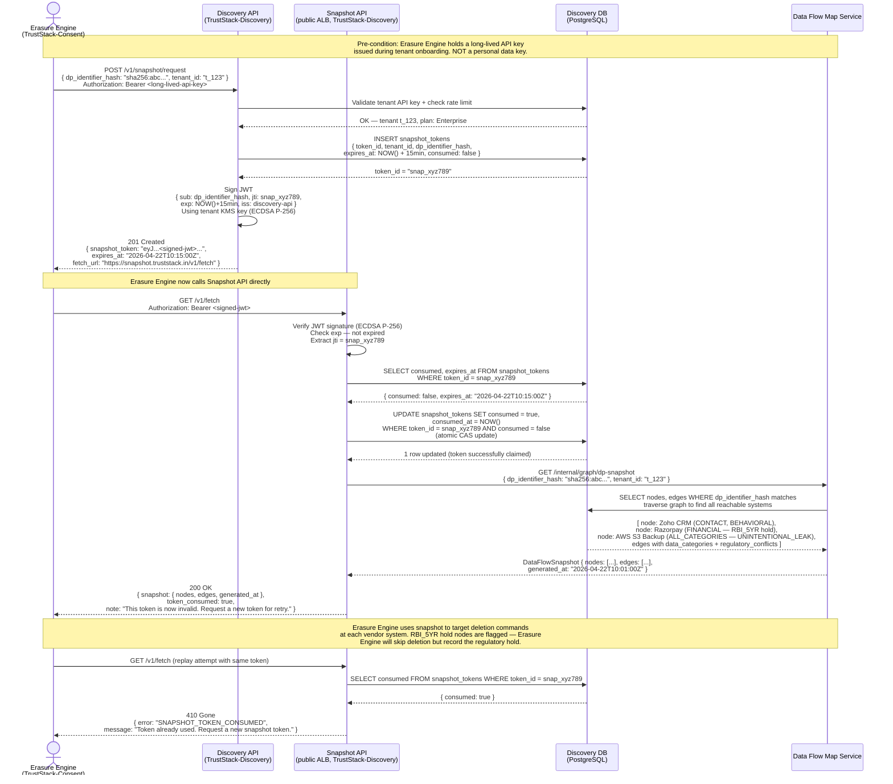

# Module 2 — Data Discovery: Pipeline Flows

This document contains two diagrams:

1. **Discovery Agent Pipeline** — the complete flowchart from scan trigger through PII detection, classification, risk scoring, and Data Flow Map assembly, including all regulatory safety gates.
2. **Snapshot API Sequence** — the precise interaction between the Erasure Engine (Module 3) and the Snapshot API when requesting a Data Principal's data location snapshot for a deletion run.

---

## Discovery Agent Pipeline

The pipeline is driven by Temporal.io workflows. The top-level `DiscoveryScanWorkflow` fans out one child workflow per configured connector in parallel, then fans results back in through the `MapperAgent`. This design means a Zoho connector timeout does not block a Razorpay scan — each connector's failure is isolated and retried independently.

All PII values are **hashed before leaving the ScannerAgent** — subsequent stages (ClassifierAgent, RiskScorerAgent, MapperAgent) work only on hashed values and metadata. The LLM Gateway never receives raw personal data.

```mermaid
flowchart TD
    A([DPO / CTO triggers scan\nvia Discovery API]) --> B[API creates scan_job record\nstatus = QUEUED]
    B --> C[API calls Temporal:\nStartWorkflow DiscoveryScanWorkflow\nwith job_id + connector_ids]

    C --> D{Temporal Orchestrator\nDiscoveryScanWorkflow}

    D -->|"Fan-out: parallel child workflows\none per connector"| E1
    D -->|"Fan-out: parallel child workflows\none per connector"| E2
    D -->|"Fan-out: parallel child workflows\none per connector"| E3
    D -->|"Fan-out: parallel child workflows\none per connector"| E4
    D -->|"Fan-out: parallel child workflows\none per connector"| E5

    subgraph zoho_flow["ConnectorWorkflow: Zoho CRM"]
        E1[ConnectorAgent\nZoho OAuth2 auth\nEnumerate: Contacts, Deals, Tickets\nStream batches of 500 records]
        E1 --> F1[ScannerAgent\nChunk records into 50-token windows\nLLM Gateway: PII detection\nHash all PII values SHA-256\nEmit PIIFindings]
        F1 --> G1[ClassifierAgent\nMap entity types to DPDPA categories\nCONTACT / BEHAVIORAL / FINANCIAL\nDetect regulatory conflicts]
        G1 --> H1[RiskScorerAgent\nCompute weighted score]
    end

    subgraph razorpay_flow["ConnectorWorkflow: Razorpay"]
        E2[ConnectorAgent\nAPI key auth read-scope\nEnumerate: Payments, Customers, KYC\nStream batches of 200 records]
        E2 --> F2[ScannerAgent\nChunk + LLM PII detect\nHash values\nEmit PIIFindings]
        F2 --> G2[ClassifierAgent\nMap: FINANCIAL + PERSONAL_IDENTITY\nFlag RBI_5YR regulatory conflict]
        G2 --> H2[RiskScorerAgent\nCompute weighted score]
    end

    subgraph tally_flow["ConnectorWorkflow: Tally"]
        E3[ConnectorAgent\nTally XML Gateway\nEnumerate: Ledgers, Invoices, Parties\nStream batches of 300 records]
        E3 --> F3[ScannerAgent\nChunk + LLM PII detect\nHash values\nEmit PIIFindings]
        F3 --> G3[ClassifierAgent\nMap: FINANCIAL\nFlag GST_6YR regulatory conflict]
        G3 --> H3[RiskScorerAgent\nCompute weighted score]
    end

    subgraph s3_flow["ConnectorWorkflow: AWS S3 / Logs"]
        E4[ConnectorAgent\nCross-account IAM read role\nEnumerate: Buckets, Objects, CloudWatch log groups\nStream object metadata + sampled content]
        E4 --> F4[ScannerAgent\nChunk + LLM PII detect\nHash values\nEmit PIIFindings]
        F4 --> G4[ClassifierAgent\nMap: ALL_CATEGORIES\nFlag UNINTENTIONAL_LEAK if PII in backups/logs]
        G4 --> H4[RiskScorerAgent\nCompute weighted score]
    end

    subgraph wa_flow["ConnectorWorkflow: WhatsApp Business"]
        E5[ConnectorAgent\nWhatsApp Business API auth\nEnumerate: Templates, Message metadata\nStream contact + delivery metadata]
        E5 --> F5[ScannerAgent\nChunk + LLM PII detect\nHash values\nEmit PIIFindings]
        F5 --> G5[ClassifierAgent\nMap: CONTACT\nCheck consent on file]
        G5 --> H5[RiskScorerAgent\nCompute weighted score]
    end

    %% Risk scoring formula
    H1 & H2 & H3 & H4 & H5 --> RISK_NOTE

    RISK_NOTE["Risk Score Formula per finding:\nbase_score\n× 2.0 if cross_border_flag\n× 1.5 if no_consent_on_file\n× 1.8 if regulatory_conflict\n× 1.3 if FINANCIAL category\n× 2.5 if MINOR_DATA flag\nCapped at 10.0"]

    RISK_NOTE --> SAFETY

    subgraph SAFETY["Safety Gate Checks — ClassifierAgent"]
        SG1{PII found in\nlogs or backups?}
        SG1 -->|Yes| SG1Y[Flag: UNINTENTIONAL_LEAK\nSet risk_level = CRITICAL\nAlert DPO immediately]
        SG1 -->|No| SG2

        SG2{Financial data\nin Razorpay?}
        SG2 -->|Yes| SG2Y[Flag: RBI_5YR\nregulatory_conflict = TRUE\nCannot erase until 5yr hold expires]
        SG2 -->|No| SG3

        SG3{Minor / child\ndata detected?}
        SG3 -->|Yes| SG3Y[Flag: SECTION_9_CRITICAL\nrisk_level = CRITICAL\nBlock scan — notify DPO + legal immediately]
        SG3 -->|No| SG4

        SG4{Data stored on\nnon-Indian servers?}
        SG4 -->|Yes| SG4Y[Flag: SECTION_16_CROSS_BORDER\nrisk_level = HIGH\nDPBI access must be confirmed]
        SG4 -->|No| SG5[Continue — standard risk level]
    end

    SG1Y & SG2Y & SG3Y & SG4Y & SG5 --> MAPPER

    MAPPER[MapperAgent\nFan-in all connector results\nBuild or update Data Flow Map graph\nNodes: systems | Edges: data category flows\nAttach risk scores + flags to edges]

    MAPPER --> PERSIST[Persist graph to\nData Flow Map Service\nWrite pii_findings to Discovery DB]

    PERSIST --> REPORT[Report Generator\nCompose visual Data Flow Map\nRisk summary: system × risk × top finding\nRemediation recommendations]

    REPORT --> NOTIF{Max risk score\nabove tenant threshold?}
    NOTIF -->|Yes| NOTIF_Y[Send alert to DPO\nEmail + in-app notification\nInclude top 5 critical findings]
    NOTIF -->|No| NOTIF_N[Update scan_job status = COMPLETE\nNo alert sent]

    NOTIF_Y & NOTIF_N --> SNAP_PRE[Pre-compute Snapshot index\nDP-identifier → [node_ids] mapping\nStored in snapshot_tokens table\nReady for Erasure Engine on demand]

    SNAP_PRE --> DONE([Scan complete\nData Flow Map available\nin Discovery API dashboard])

    %% Styling
    classDef critical fill:#cc2200,color:#fff,stroke:#991100
    classDef high fill:#dd6600,color:#fff,stroke:#aa4400
    classDef info fill:#1a5276,color:#fff,stroke:#154360
    classDef gate fill:#5b2c8b,color:#fff,stroke:#4a235a
    classDef success fill:#1e8449,color:#fff,stroke:#196f3d

    class SG1Y,SG3Y critical
    class SG2Y,SG4Y high
    class SAFETY gate
    class DONE success
    class RISK_NOTE info
```

---

## Snapshot API — Erasure Engine Integration Sequence

When the Erasure Engine (Module 3, running in `TrustStack-Consent` account) needs to delete a Data Principal's data, it first needs to know which downstream vendor systems hold that person's data. It cannot query the Discovery DB directly — the accounts are air-gapped. Instead, it calls the Snapshot API with a one-time signed token.

The token is valid for **15 minutes** and is **single-use**. Once consumed, any replay attempt returns HTTP 410 Gone. This prevents the Erasure Engine from building a persistent cache of data locations — every erasure run requires a fresh authorization.



---

## Pipeline Design Decisions

| Decision | Rationale |
|---|---|
| Temporal.io for orchestration | Long-running scans (hours for large Zoho CRM tenants) need durable execution with automatic retries; Temporal persists workflow state across worker restarts |
| Parallel fan-out per connector | A slow or failing connector (e.g., Tally XML Gateway timeout) does not block other connectors; each child workflow has independent retry budget |
| Hash PII before leaving ScannerAgent | Discovery DB contains zero personal data values; satisfies Zero-Knowledge principle and limits blast radius if DB is compromised |
| Section 9 (minor data) blocks scan | Child data is the most sensitive category under DPDPA; automatic block-and-escalate prevents the platform from silently continuing a scan where unlawful processing may be occurring |
| One-time snapshot tokens | Prevents Erasure Engine from caching stale data locations; forces a fresh snapshot per erasure run, ensuring the deletion target list reflects the current Data Flow Map |
| 15-minute token expiry | Short enough to limit window for token interception; long enough for Erasure Engine to receive the token, make the fetch call, and begin issuing deletion commands |
