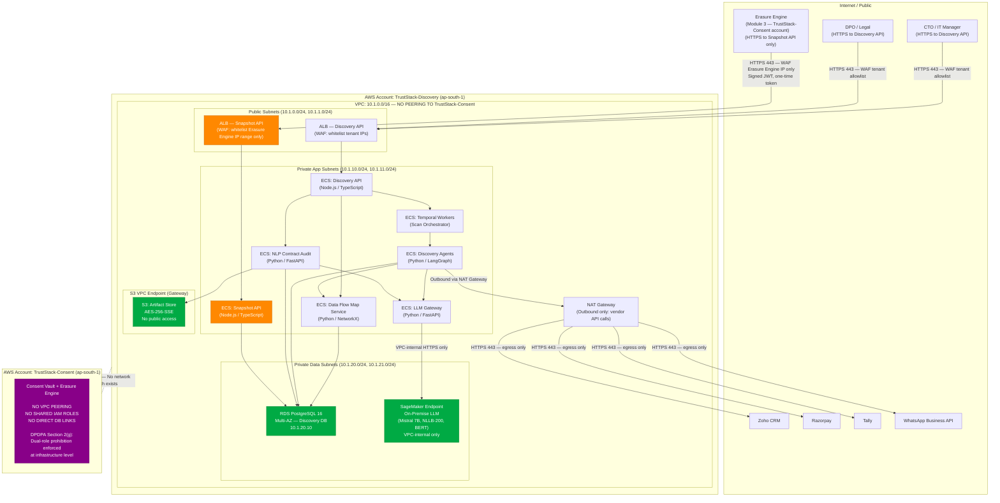

# Module 2 — Data Discovery: System Architecture

This document contains two complementary architectural views of the TrustStack Data Discovery Engine:

1. **C4 Container Diagram** — shows every container inside the Discovery system boundary, external actors, and how they relate.
2. **Network Isolation Diagram** — shows the AWS account and VPC boundary that enforces the DPDPA dual-role prohibition (Section 2(g)).

---

## C4 Container Diagram

The Discovery Engine runs entirely inside `TrustStack-Discovery`, an AWS account that is **completely isolated** from `TrustStack-Consent`. There is no VPC peering, no shared IAM roles, and no direct database links between the two accounts. This architectural hard-wall is the primary technical enforcement of the DPDPA dual-role prohibition: TrustStack cannot act as both Consent Manager and Data Processor for the same Data Principal.

The Erasure Engine (Module 3) is the only external system permitted to call into Discovery, and it does so only through the one-time signed Snapshot API — never through a persistent connection.

```mermaid
C4Container
    title TrustStack — Module 2: Data Discovery Engine (AWS ap-south-1, TrustStack-Discovery account)

    Person(cto, "CTO / IT Manager", "Configures vendor connectors, triggers scans, reviews Data Flow Map")
    Person(dpo, "DPO / Legal", "Uploads vendor contracts, reviews audit reports, downloads signed DPAs")

    System_Ext(zoho, "Zoho CRM / Books / Desk", "Customer, financial, and support PII — read-only")
    System_Ext(razorpay, "Razorpay", "Payment and KYC data — read-only, RBI 5-yr retention applies")
    System_Ext(tally, "Tally", "Accounting and financial records — read-only, GST 6-yr retention applies")
    System_Ext(s3ext, "AWS S3 / Data Lake", "Customer backups, exports, logs — read-only")
    System_Ext(whatsapp, "WhatsApp Business API", "Contact and message metadata — read-only")
    System_Ext(erasure, "Erasure Engine (Module 3)", "Calls Snapshot API to determine which vendor systems hold a Data Principal's data before issuing deletion commands")
    System_Ext(consentvault, "Consent Vault (Module 3)", "DOES NOT connect to Discovery — architectural air-gap per DPDPA Section 2(g) dual-role prohibition")

    System_Boundary(discovery, "Discovery Engine — TrustStack-Discovery AWS Account") {

        Container(api, "Discovery API", "Node.js / TypeScript ESM, Express", "REST API: connector config, scan trigger/cancel, contract upload, report download. Authenticates tenants, issues signed Snapshot tokens.")

        Container(orchestrator, "Scan Orchestrator", "Temporal.io Workers (Node.js)", "Manages long-running DiscoveryScanWorkflow instances. Fan-out to connector activities, fan-in results to MapperAgent. Handles retries, timeouts, and partial failures.")

        Container(registry, "Connector Plugin Registry", "Node.js / TypeScript ESM", "Plugin host for vendor-specific connectors. Each plugin implements a standard interface: authenticate(), enumerate(), streamBatches(). Credentials are read from vault ref — never stored in DB.")

        Container(agents, "Discovery Agents", "Python 3.12 / LangGraph", "Five stateful agents run as Temporal activities:\n• ConnectorAgent — auth + enumerate + stream\n• ScannerAgent — chunk, LLM PII detect, hash values\n• ClassifierAgent — map entity types to DPDPA categories, detect regulatory conflicts\n• RiskScorerAgent — compute weighted risk score\n• MapperAgent — assemble/update Data Flow Map graph")

        Container(nlp_service, "NLP Contract Audit Service", "Python / FastAPI", "Accepts contract upload (PDF/DOCX/image). Orchestrates the 9-stage NLP pipeline. Exposes audit status and compliance report endpoints. Signs completed DPA with tenant KMS key.")

        Container(nlp_pipeline, "NLP Pipeline", "Python / LangGraph", "Sequential pipeline of agents:\n1. FileProcessor → 2. OCRAgent (Tesseract 5 + Indic packs) → 3. LanguageDetector → 4. TranslationAgent → 5. ClauseExtractor (BERT) → 6. ComplianceChecker → 7. GapAnalyzer → 8. DPAGenerator → 9. ECDSA Signer")

        Container(llm_gw, "LLM Gateway", "Python / FastAPI", "Single choke-point for all LLM calls. Enforces: no PII in raw form to LLM (hash first), rate limiting per tenant, model routing (PII detection → Mistral 7B, translation → NLLB-200, DPA generation → Mistral 7B). Audit logs every prompt/response shape.")

        Container(map_svc, "Data Flow Map Service", "Python / NetworkX + Node.js API layer", "Maintains the directed graph of data flows per tenant. Nodes = systems; edges = data category flows with risk scores. Exposes graph queries (paths, high-risk subgraph, DP-specific traversal for Snapshot API).")

        Container(snapshot_api, "Snapshot API", "Node.js / TypeScript ESM", "Public-facing HTTPS endpoint (separate ALB). Validates signed JWT from Erasure Engine, executes DP-scoped graph traversal, returns one-time snapshot, marks token consumed.")

        ContainerDb(db, "Discovery DB", "PostgreSQL 16, RDS Multi-AZ, ap-south-1", "Stores: tenants, connector_configs, scan_jobs, pii_findings, data_flow_nodes, data_flow_edges, snapshot_tokens, contract_audits, contract_clauses, dpa_generations, discovery_audit_log. Append-only audit tables. No personal data values — only hashes.")

        ContainerDb(artifact_store, "Artifact Store", "AWS S3, AES-256-SSE, ap-south-1", "Stores: signed DPA PDFs/DOCX files, scan reports, Data Flow Map exports. Versioned. 7-year retention per DPDPA Rule 4. Pre-signed URLs with 15-min expiry for downloads.")

        ContainerDb(llm_host, "On-Premise LLM", "AWS SageMaker Endpoint, ap-south-1\nMistral 7B (fine-tuned: PII, DPDPA, Indian languages)", "Hosts all inference models inside the Discovery VPC. No data leaves Indian AWS region. Models: Mistral 7B (PII/compliance), NLLB-200 (22-language translation), BERT-multilingual (clause segmentation).")
    }

    %% External actors into API
    Rel(cto, api, "Configure connectors, trigger scans, view Data Flow Map", "HTTPS / REST")
    Rel(dpo, api, "Upload contracts, view audit reports, download signed DPAs", "HTTPS / REST")

    %% API to internal containers
    Rel(api, orchestrator, "Start / cancel DiscoveryScanWorkflow", "Temporal SDK / gRPC")
    Rel(api, nlp_service, "Submit contract, poll status, retrieve report", "HTTP internal")
    Rel(api, map_svc, "Query Data Flow Map for tenant", "HTTP internal")
    Rel(api, snapshot_api, "Issue signed JWT token to Erasure Engine caller", "internal token issuance")

    %% Orchestrator fan-out
    Rel(orchestrator, registry, "Resolve and load vendor connector plugin", "Node.js module call")
    Rel(orchestrator, agents, "Schedule ConnectorAgent, ScannerAgent, ClassifierAgent, RiskScorerAgent, MapperAgent as Temporal activities", "Temporal activity dispatch")

    %% Connector Plugin Registry to external vendor systems
    Rel(registry, zoho, "Read contacts, deals, tickets via OAuth2 / Zoho API", "HTTPS read-only")
    Rel(registry, razorpay, "Read payment and KYC records via API key (read scope)", "HTTPS read-only")
    Rel(registry, tally, "Read ledger and invoice data via Tally XML Gateway", "HTTPS read-only")
    Rel(registry, s3ext, "Read objects via cross-account IAM role (read-only)", "HTTPS read-only")
    Rel(registry, whatsapp, "Read message metadata via WhatsApp Business API", "HTTPS read-only")

    %% Agents to LLM Gateway
    Rel(agents, llm_gw, "PII detection: send hashed record chunks", "HTTP internal")
    Rel(agents, map_svc, "Publish node/edge updates after each connector scan", "HTTP internal")

    %% NLP Pipeline
    Rel(nlp_service, nlp_pipeline, "Execute 9-stage pipeline as async job", "internal dispatch")
    Rel(nlp_pipeline, llm_gw, "Translation, clause analysis, DPA generation requests", "HTTP internal")
    Rel(nlp_pipeline, artifact_store, "Store signed DPA PDF/DOCX, OCR text", "AWS SDK / S3 PutObject")

    %% LLM Gateway to model host
    Rel(llm_gw, llm_host, "Model inference — VPC-internal only", "HTTPS / VPC internal endpoint")

    %% Data Flow Map to DB
    Rel(map_svc, db, "Persist and query graph nodes, edges, risk scores", "PostgreSQL / pgvector")

    %% Discovery Agents to DB (findings)
    Rel(agents, db, "Write pii_findings, scan_jobs, discovery_audit_log", "PostgreSQL")

    %% NLP Service to DB
    Rel(nlp_service, db, "Write contract_audits, contract_clauses, dpa_generations", "PostgreSQL")

    %% Snapshot API
    Rel(snapshot_api, db, "Query data_flow_nodes/edges for DP, mark token consumed", "PostgreSQL")
    Rel(erasure, snapshot_api, "Request Data Flow Map snapshot for Data Principal (signed API key + JWT)", "HTTPS / public ALB")

    UpdateLayoutConfig($c4ShapeInRow="3", $c4BoundaryInRow="1")
```

---

## Network Isolation Diagram

This diagram visualises the AWS-level isolation that makes the dual-role prohibition technically enforceable — not merely a policy. The Discovery Engine lives in a completely separate AWS account with no network path to `TrustStack-Consent`. The only permitted inbound traffic is the Snapshot API, which sits behind its own Application Load Balancer and accepts only requests carrying a valid signed JWT issued by the Discovery API itself.

---

## Key Architectural Decisions

| Decision | Rationale |
|---|---|
| Separate AWS account (not just separate VPC) | Account-level isolation is stronger than VPC peering controls; prevents accidental IAM misconfigs from bridging Discovery and Consent |
| No personal data values in Discovery DB | All PII values are SHA-256 hashed before storage; only the Connector Plugin Registry sees plaintext, only in memory, only during the scan activity |
| Snapshot API as the only inbound path from Module 3 | Enforces one-way data flow: Erasure Engine learns *where* data lives, but Discovery never learns *what consent decisions were made* |
| On-premise LLM (SageMaker, ap-south-1) | All Indian-language inference stays within Indian AWS region per DPDPA Section 16 cross-border restriction; no OpenAI/Anthropic API calls for PII-adjacent data |
| One-time signed JWT for Snapshot tokens | Prevents token replay attacks; Erasure Engine must request a fresh token per Data Principal erasure request |
