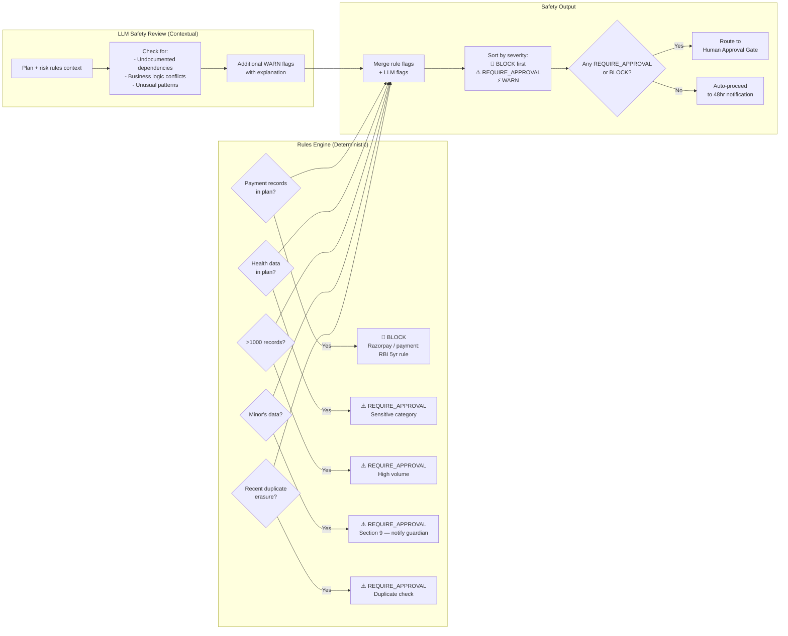
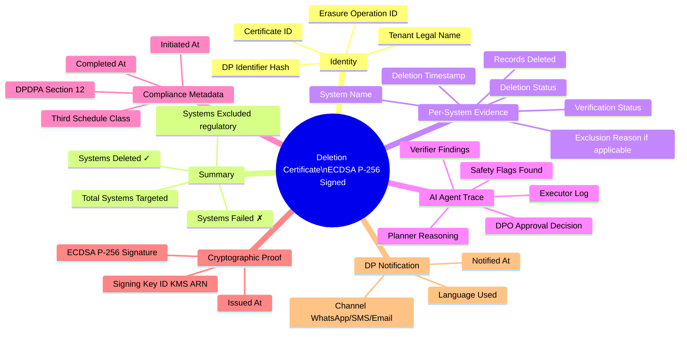

# Agentic Erasure Flow Diagrams

## 1. Full Multi-Agent Pipeline

```mermaid
flowchart TD
    TRIGGER([Erasure Triggered]) --> TRIGGER_TYPE{Source}
    TRIGGER_TYPE -->|Kafka: consent.withdrawn| AUTO[Automatic trigger\nfrom Consent Vault]
    TRIGGER_TYPE -->|API: POST /v1/erasure| MANUAL[DPO manual request\nor API integration]
    TRIGGER_TYPE -->|Temporal timer| SCHEDULED[Scheduled 3yr\nclass-timeline expiry]

    AUTO --> FETCH_MAP
    MANUAL --> FETCH_MAP
    SCHEDULED --> FETCH_MAP

    FETCH_MAP[Fetch Data Flow Map\nfrom Module 2 snapshot API\none-time, time-limited token] --> PLANNER

    subgraph planner_agent["🤖 Agent 1: Planner"]
        PLANNER[LLM reads Data Flow Map\n+ tenant system config] --> GEN_PLAN[Generate ErasurePlan:\n- Systems list\n- Deletion methods\n- Execution order\n- Estimated records]
        GEN_PLAN --> PLAN_REASONING[Natural language reasoning:\n'Deleted CRM before DB because\nCRM has foreign key to DB users'\nVisible to DPO in dashboard]
    end

    PLAN_REASONING --> SAFETY

    subgraph safety_agent["🛡️ Agent 2: Safety"]
        SAFETY[Rules engine checks:\n- Regulatory conflicts\n- Volume thresholds\n- Sensitive categories\n- Identity verification] --> SAFETY_LLM[LLM enriches:\n- Business logic conflicts\n- Dependency risks\n- Edge cases]
        SAFETY_LLM --> FLAGS{Safety flags found?}
    end

    FLAGS -->|No flags| NOTIFICATION_48
    FLAGS -->|WARN only| NOTIFICATION_48
    FLAGS -->|REQUIRE_APPROVAL| HUMAN_GATE

    subgraph human_gate["👤 Human Approval Gate"]
        HUMAN_GATE[DPO sees:\n- Full deletion plan\n- Risk annotations\n- Conflict details\n- Estimated impact] --> DPO_ACTION{DPO decision}
        DPO_ACTION -->|Approve as-is| NOTIFICATION_48
        DPO_ACTION -->|Modify plan\nexclude systems| MODIFIED_PLAN[Apply modifications\nto ErasurePlan]
        DPO_ACTION -->|Reject| CANCELLED([Erasure Cancelled\nDP notified of delay])
        DPO_ACTION -->|No response 24hr| TIMEOUT_NOTIFY[Alert DPO manager\nEscalate]
        MODIFIED_PLAN --> NOTIFICATION_48
    end

    NOTIFICATION_48[Send 48hr pre-deletion notification\nto DP in their language\nHindi / Tamil / etc.] --> WAIT_48{48hr window}

    WAIT_48 -->|DP cancels| DP_CANCELLED([DP cancelled erasure\nConsent can be re-granted])
    WAIT_48 -->|Emergency stop| EMERGENCY_PAUSE([Emergency stop\nPartial certificate issued])
    WAIT_48 -->|Window expires| EXECUTOR

    subgraph executor_agent["⚡ Agent 3: Executor"]
        EXECUTOR[Execute deletions\nin planned order] --> PER_SYSTEM{For each system}
        PER_SYSTEM --> CALL_API[Call system connector:\nZoho / Razorpay / Tally\n/ S3 / custom API]
        CALL_API --> API_RESULT{Result}
        API_RESULT -->|Success| NEXT_SYSTEM[Mark DELETED\nContinue to next]
        API_RESULT -->|Timeout / Error| RETRY[Retry 3x\nexponential backoff]
        RETRY --> RETRY_RESULT{Retry result}
        RETRY_RESULT -->|Succeeds| NEXT_SYSTEM
        RETRY_RESULT -->|Still fails| MARK_FAILED[Mark FAILED\nDPO alerted\nContinue others]
        NEXT_SYSTEM --> PER_SYSTEM
        MARK_FAILED --> PER_SYSTEM
        PER_SYSTEM -->|All done| EXEC_DONE[Execution complete]
    end

    subgraph verifier_agent["🔍 Agent 4: Verifier"]
        EXEC_DONE --> VERIFY_EACH[For each DELETED system:\nQuery independently to confirm\ne.g. GET /contact → expect 404]
        VERIFY_EACH --> VERIFY_RESULT{Data still present?}
        VERIFY_RESULT -->|Not found = ✓| VERIFIED[Mark VERIFIED]
        VERIFY_RESULT -->|Still found = ✗| VERIFY_FAILED[Mark FAILED\nDPO alert\nInclude in certificate]
        VERIFIED --> ALL_VERIFIED
        VERIFY_FAILED --> ALL_VERIFIED
        ALL_VERIFIED[Verification complete]
    end

    subgraph certifier_agent["📜 Agent 5: Certifier"]
        ALL_VERIFIED --> ASSEMBLE[Assemble certificate:\n- Per-system status\n- Agent reasoning trace\n- Timestamps\n- Verifier findings]
        ASSEMBLE --> SIGN[ECDSA P-256 sign\nvia tenant KMS key]
        SIGN --> STORE[Store certificate:\n- PostgreSQL\n- S3 Glacier 7yr]
        STORE --> NOTIFY_DP[Send DP completion notification\nin their language]
        NOTIFY_DP --> KAFKA_EMIT[emit erasure.executed\nto Kafka for War Room]
    end

    KAFKA_EMIT --> COMPLETE([✅ Erasure Complete\nCertificate issued])

    style CANCELLED fill:#ffcccb
    style DP_CANCELLED fill:#ffe4b5
    style EMERGENCY_PAUSE fill:#ffe4b5
    style COMPLETE fill:#90EE90
    style planner_agent fill:#e6f3ff,stroke:#4499ff
    style safety_agent fill:#fff3e6,stroke:#ff9900
    style human_gate fill:#f0e6ff,stroke:#9933ff
    style executor_agent fill:#e6ffe6,stroke:#009900
    style verifier_agent fill:#ffe6f0,stroke:#cc0066
    style certifier_agent fill:#e6fff0,stroke:#00cc66
```

---

## 2. Safety Gate Detail

```mermaid
flowchart LR
    subgraph rules_engine["Rules Engine (Deterministic)"]
        R1{Payment records\nin plan?} -->|Yes| BLOCK_PAYMENT[🚫 BLOCK\nRazorpay / payment:\nRBI 5yr rule]
        R2{Health data\nin plan?} -->|Yes| APPROVE_HEALTH[⚠️ REQUIRE_APPROVAL\nSensitive category]
        R3{>1000 records?} -->|Yes| APPROVE_VOLUME[⚠️ REQUIRE_APPROVAL\nHigh volume]
        R4{Minor's data?} -->|Yes| APPROVE_MINOR[⚠️ REQUIRE_APPROVAL\nSection 9 — notify guardian]
        R5{Recent duplicate\nerasure?} -->|Yes| APPROVE_DUPE[⚠️ REQUIRE_APPROVAL\nDuplicate check]
    end

    subgraph llm_review["LLM Safety Review (Contextual)"]
        LLM_IN[Plan + risk rules context] --> LLM_CHECK[Check for:\n- Undocumented dependencies\n- Business logic conflicts\n- Unusual patterns]
        LLM_CHECK --> LLM_FLAGS[Additional WARN flags\nwith explanation]
    end

    subgraph output["Safety Output"]
        ALL_FLAGS[Merge rule flags\n+ LLM flags] --> SEVERITY_SORT[Sort by severity:\n🚫 BLOCK first\n⚠️ REQUIRE_APPROVAL\n⚡ WARN]
        SEVERITY_SORT --> DECISION{Any REQUIRE_APPROVAL\nor BLOCK?}
        DECISION -->|Yes| NEEDS_GATE[Route to\nHuman Approval Gate]
        DECISION -->|No| AUTO_PROCEED[Auto-proceed\nto 48hr notification]
    end

    R1 --> ALL_FLAGS
    R2 --> ALL_FLAGS
    R3 --> ALL_FLAGS
    R4 --> ALL_FLAGS
    R5 --> ALL_FLAGS
    LLM_FLAGS --> ALL_FLAGS
```

---

## 3. Deletion Certificate Structure

```mermaid
mindmap
    root((Deletion Certificate\nECDSA P-256 Signed))
        Identity
            Certificate ID
            Erasure Operation ID
            Tenant Legal Name
            DP Identifier Hash
        Summary
            Total Systems Targeted
            Systems Deleted ✓
            Systems Failed ✗
            Systems Excluded regulatory
        Per-System Evidence
            System Name
            Deletion Status
            Records Deleted
            Deletion Timestamp
            Verification Status
            Exclusion Reason if applicable
        AI Agent Trace
            Planner Reasoning
            Safety Flags Found
            DPO Approval Decision
            Executor Log
            Verifier Findings
        Compliance Metadata
            DPDPA Section 12
            Third Schedule Class
            Initiated At
            Completed At
        Cryptographic Proof
            ECDSA P-256 Signature
            Signing Key ID KMS ARN
            Issued At
        DP Notification
            Notified At
            Language Used
            Channel WhatsApp/SMS/Email
```
