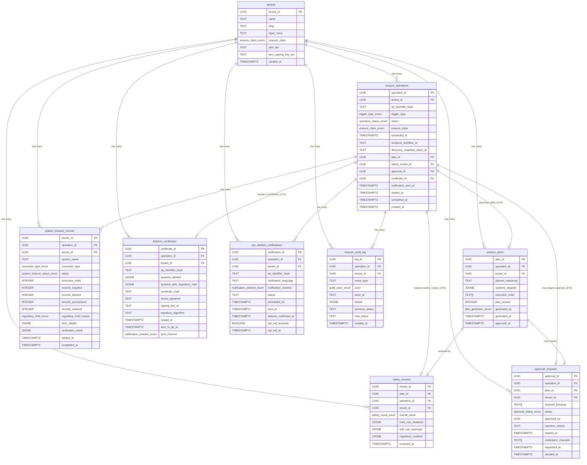

# ER Diagram — Automatic Erasure Engine Data Model

**Version:** 1.0
**Date:** 2026-04-22
**Module:** 3.2 — Erasure Engine (TrustStack)

---

## Design Rationale

### Why `dp_identifier_hash` and never raw PII

Every table that references a Data Principal uses `dp_identifier_hash` — an HMAC-SHA-256 of the raw identifier (phone/email/user_id), keyed per tenant. The Erasure Engine database never stores a name, phone number, email address, or any other directly identifying field. This means:

- A database breach exposes zero DP identity data.
- TrustStack itself cannot identify which DP an erasure was for without the tenant's keying secret (zero-knowledge for TrustStack).
- The hash is consistent across all tables for a given DP, enabling joins without storing PII.

This satisfies DPDPA's data minimisation principle (Section 6(2)) and eliminates the irony of a compliance tool that itself holds a DP's personal data.

### Why the audit log is append-only

`erasure_audit_log` has a DDL-level trigger (`BEFORE UPDATE OR DELETE`) that raises an exception unconditionally. No application bug, SQL injection, or rogue query can alter a historical audit event. This is a regulatory requirement: DPDPA Rule 4 mandates that Registered Consent Managers retain processing logs for 7 years in a form that can be presented to DPBI on demand. A mutable log has no legal value — a DPO cannot certify to DPBI that the log accurately reflects what happened if anyone with database access could have changed it.

### Why deletion certificates are ECDSA-signed

The `deletion_certificates` table stores the ECDSA P-256 signature computed by AWS KMS using the **tenant's own KMS key**. This has two consequences:

1. TrustStack itself cannot forge a certificate for a tenant — it does not hold the private key.
2. Any third party (DPBI auditor, court) can verify the certificate's authenticity and integrity by checking the signature against the tenant's published public key, without needing TrustStack's participation.

The signature covers a SHA-256 hash of the full certificate JSON payload. Any post-issuance modification to any field invalidates the signature. This makes the certificate tamper-evident.

### Why Temporal.io is the execution state owner, not PostgreSQL

The database stores results — plans, safety reviews, certificates, audit events. Temporal.io stores execution state — which step the workflow is on, what signals have been received, what timers are pending. This split exists because:

- Erasure workflows for `ECOMMERCE_GT_2CR` class tenants may sleep for up to 3 years before executing. A cron job or database-scheduled task cannot reliably wake up 3 years from now across infrastructure changes, deployments, and team turnover. Temporal's durable timers survive all of these.
- Temporal provides strong exactly-once activity execution guarantees, preventing double-deletion bugs.
- The `temporal_workflow_id` on `erasure_operations` is the handle used to send signals (approval, emergency stop) to the running workflow.

### Why `erasure_operations` has nullable FKs for downstream tables

`erasure_operations.plan_id`, `safety_review_id`, `approval_id`, and `certificate_id` start NULL and are populated as each pipeline stage completes. This allows the operation record to be created at trigger time and then updated as the Temporal workflow progresses — without requiring all downstream tables to exist yet. The FKs are `DEFERRABLE INITIALLY DEFERRED` to handle circular dependency resolution at table creation time.

---

## Entity Relationship Diagram

---

## Table Relationships Summary

| Relationship | Cardinality | Notes |
|---|---|---|
| `tenants` → `erasure_operations` | 1:many | One tenant has many erasure operations over time. |
| `erasure_operations` → `erasure_plans` | 1:0..1 | One plan per operation. NULL until Planner Agent completes. |
| `erasure_operations` → `safety_reviews` | 1:0..1 | One safety review per operation. NULL until Safety Agent completes. |
| `erasure_operations` → `approval_requests` | 1:0..1 | Only present when Safety Agent escalates (`REQUIRES_HUMAN`). |
| `erasure_operations` → `deletion_certificates` | 1:0..1 | Issued at completion (full or partial). NULL while executing. |
| `erasure_operations` → `system_erasure_records` | 1:many | One record per target system (e.g., 7 systems = 7 rows). |
| `erasure_operations` → `pre_deletion_notifications` | 1:many | Typically 1 per operation; may be multiple for retry. |
| `erasure_operations` → `erasure_audit_log` | 1:many | 10–50 events per typical operation lifecycle. |
| `erasure_plans` → `safety_reviews` | 1:1 | Every plan gets exactly one Safety Agent review. |
| `erasure_plans` → `approval_requests` | 1:0..1 | Approval is against the plan; re-plan invalidates approval. |

---

## Key Index Patterns

| Query pattern | Index |
|---|---|
| DPO dashboard: all pending approvals for tenant | `idx_approvals_pending (tenant_id, expires_at) WHERE status = 'PENDING'` |
| Kafka consumer: check if DP already has active erasure | `idx_erasure_ops_dp_hash (dp_identifier_hash)` |
| Temporal scheduler: find upcoming deferred erasures | `idx_erasure_ops_scheduled (scheduled_at) WHERE status NOT IN (terminal)` |
| DPBI audit: full history for one operation | `idx_audit_operation (operation_id, created_at ASC)` |
| Certificate lookup by DP (e.g., re-send) | `idx_certs_dp_hash (dp_identifier_hash)` |
