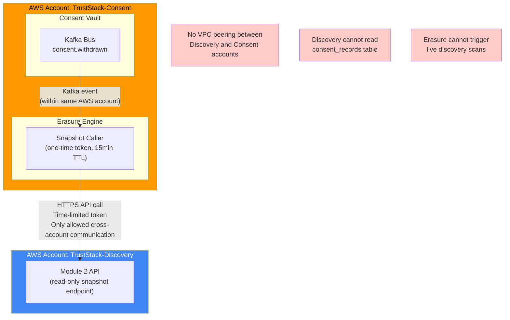

# Erasure Engine System Architecture

## Component Architecture

```mermaid
C4Container
    title Erasure Engine — Container Architecture

    Person(dpo, "DPO / Compliance Head", "Manages erasure operations. Reviews AI plans. Approves high-risk deletions.")
    Person(cto, "CTO / IT Manager", "API integration. Monitors operation health.")

    System_Ext(consent_vault, "Consent Vault (Module 3.1)", "Emits consent.withdrawn events via Kafka")
    System_Ext(discovery, "Discovery Engine (Module 2)", "Provides Data Flow Map snapshot (one-time token)")
    System_Ext(war_room, "Regulatory War Room (Module 3.3)", "Consumes erasure.executed events for CXO dashboard")
    System_Ext(zoho, "Zoho CRM", "Deletion target")
    System_Ext(razorpay, "Razorpay", "Deletion target (financial — may be excluded)")
    System_Ext(tally, "Tally", "Deletion target (financial — may be excluded)")
    System_Ext(dp_notif, "DP (Data Principal)", "Receives pre-deletion and completion notifications")

    System_Boundary(erasure_boundary, "Erasure Engine (AWS ap-south-1)") {
        Container(api, "Erasure API", "Node.js / TypeScript ESM", "Trigger erasure, dry-run, status, approve, certificate download")
        Container(kafka_consumer, "Kafka Consumer", "Node.js", "Listens for consent.withdrawn events")
        Container(temporal_client, "Temporal Client", "Node.js", "Submits workflows, sends signals (approve/stop)")

        Container(temporal_workers, "Temporal Workers", "Node.js", "ErasureOrchestrator workflow. Calls all agent activities.")

        Container(planner, "Planner Agent", "Python / LangGraph", "LLM-based: generates deletion plan from Data Flow Map")
        Container(safety, "Safety Agent", "Python / Rules + LLM", "Detects regulatory conflicts, flags risks")
        Container(executor, "Executor Agent", "Node.js", "Calls system connectors in deletion order")
        Container(verifier, "Verifier Agent", "Node.js / LLM assist", "Re-queries systems to confirm deletion")
        Container(certifier, "Certifier Agent", "Node.js", "Assembles + signs deletion certificate")

        Container(connectors, "System Connectors", "Node.js", "Zoho, Razorpay, Tally, S3, WhatsApp, Generic REST")
        Container(llm_gateway, "LLM Gateway", "Python / FastAPI", "Routes agent calls to on-premise SageMaker endpoint")

        ContainerDb(postgres, "Erasure DB", "PostgreSQL 16 (RDS)", "Erasure operations, certificates, audit log")
        ContainerDb(temporal_db, "Temporal State", "Temporal.io + PostgreSQL", "Durable workflow state — survives 3yr timelines")
        ContainerDb(sagemaker, "On-Premise LLM", "AWS SageMaker (ap-south-1)", "Mistral 7B fine-tuned — never sends data outside India")
    }

    Rel(dpo, api, "HTTPS + JWT", "Dashboard / direct API")
    Rel(cto, api, "HTTPS + API Key", "API integration")
    Rel(consent_vault, kafka_consumer, "Kafka", "consent.withdrawn events")
    Rel(kafka_consumer, temporal_client, "StartWorkflow")
    Rel(api, temporal_client, "Trigger workflow / send signals")
    Rel(temporal_client, temporal_workers, "Workflow scheduling")
    Rel(temporal_workers, planner, "Activity: generateErasurePlan")
    Rel(temporal_workers, safety, "Activity: runSafetyReview")
    Rel(temporal_workers, executor, "Activity: deleteFromSystem (×N)")
    Rel(temporal_workers, verifier, "Activity: verifyDeletion (×N)")
    Rel(temporal_workers, certifier, "Activity: generateCertificate")
    Rel(planner, llm_gateway, "LLM inference request")
    Rel(safety, llm_gateway, "LLM inference request")
    Rel(llm_gateway, sagemaker, "HTTPS (VPC-internal)")
    Rel(executor, connectors, "Deletion calls")
    Rel(verifier, connectors, "Verification queries")
    Rel(connectors, zoho, "Zoho API")
    Rel(connectors, razorpay, "Razorpay API")
    Rel(connectors, tally, "Tally connector")
    Rel(temporal_workers, postgres, "Write operation records + certs")
    Rel(temporal_workers, temporal_db, "Workflow state")
    Rel(discovery, api, "Data Flow Map snapshot (one-time token)")
    Rel(certifier, dp_notif, "Deletion confirmation in DP's language")
    Rel(temporal_workers, war_room, "Kafka: erasure.executed")
```

---

## Network Isolation (Cross-Module)

```mermaid
graph TB
    subgraph module2_account["AWS Account: TrustStack-Discovery"]
        discovery_api["Module 2 API\n(read-only snapshot endpoint)"]
    end

    subgraph module3_account["AWS Account: TrustStack-Consent"]
        subgraph erasure_service["Erasure Engine"]
            snapshot_caller["Snapshot Caller\n(one-time token, 15min TTL)"]
        end
        subgraph consent_vault_service["Consent Vault"]
            kafka_bus["Kafka Bus\nconsent.withdrawn"]
        end
    end

    snapshot_caller -->|"HTTPS API call\nTime-limited token\nOnly allowed cross-account communication"| discovery_api
    kafka_bus -->|"Kafka event\n(within same AWS account)"| snapshot_caller

    note1["No VPC peering between\nDiscovery and Consent accounts"]
    note2["Discovery cannot read\nconsent_records table"]
    note3["Erasure cannot trigger\nlive discovery scans"]

    style module2_account fill:#4285F4,color:#fff
    style module3_account fill:#FF9900,color:#000
    style note1 fill:#ffcccb
    style note2 fill:#ffcccb
    style note3 fill:#ffcccb
```
